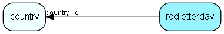

# redletterday Table (17)

Red letter days for calendar (holidays, birthday of king etc)

## Fields

| Name | Description | Type | Null |
|------|-------------|------|:----:|
|redletterday\_id|Primary key|PK| |
|reddate|The date |DateTime| |
|country\_id|Which country does this red letter day belong to. It will show up in the diary for associates with this country as homecountry.|FK [country](country.md)| |
|reds|The n´th bit corresponding to the date in dates month, is true if the color is active.|UInt|&#x25CF;|
|colored|The n´th bit corresponding to the date in dates month, is true if the color is active.|UInt|&#x25CF;|
|color|color can be one of the following: RLD_COLOR_BLACK, RLD_COLOR_RED, RLD_COLOR_SPES|UShort|&#x25CF;|
|text|Text to show on the date|String(79)|&#x25CF;|
|updatedCount|Number of updates made to this record|UShort| |
|rgbColour|Actual RGB colour index|UInt|&#x25CF;|
|extraFlags|Extra flags, spare field|UInt|&#x25CF;|

[!include[details](./includes/redletterday.md)]

## Indexes

| Fields | Types | Description |
|--------|-------|-------------|
|redletterday\_id |PK |Unique |
|country\_id, reddate |FK, DateTime |Clustered |

## Relationships

| Table|  Description |
|------|-------------|
|[country](country.md)  |Country information |

## Replication Flags

* Replicate changes DOWN from central to satellites and travellers.
* Replicate changes UP from satellites and travellers back to central.
* Copy to satellite and travel prototypes.

## Security Flags

* No access control via user's Role.

