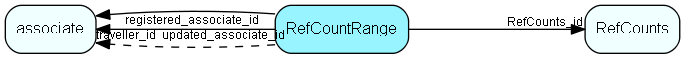

# RefCountRange Table (172)

Number allocation system, for keeping track of ranges of numbers loaned out to travel and satellite databases

## Fields

| Name | Description | Type | Null |
|------|-------------|------|:----:|
|RefCountRange\_id|Primary key|PK| |
|rangeStart|Start of range that is in use|UInt| |
|rangeSize|Size of in-use range|UInt| |
|RefCounts\_id|ID of counter this range is reserved for|FK [RefCounts](refcounts.md)| |
|traveller\_id|ID of traveller (associate) who owns this range|UShort| |
|registered|Registered when|UtcDateTime| |
|registered\_associate\_id|Registered by whom|FK [associate](associate.md)| |
|updated|Last updated when|UtcDateTime| |
|updated\_associate\_id|Last updated by whom|FK [associate](associate.md)| |
|updatedCount|Number of updates made to this record|UShort| |
|highestInUse|The highest number (within the range) that is currently in use. This used to be the infamous preference!|UInt| |

[!include[details](./includes/refcountrange.md)]

## Indexes

| Fields | Types | Description |
|--------|-------|-------------|
|RefCountRange\_id |PK |Clustered, Unique |
|RefCounts\_id |FK |Index |
|traveller\_id |UShort |Index |

## Relationships

| Table|  Description |
|------|-------------|
|[associate](associate.md)  |Employees, resources and other users - except for External persons |
|[RefCounts](refcounts.md)  |Number counter for all tables that generate numbers, e.g. templates, contacts...   This table is used for the number allocation system and should not be confused with sequence, used for allocating internal ID&apos;s. This table is replicated during generation of satellites and during local update for travellers, using special logic. By default it contains rows for the SuperOffice standard counters, including one row for each DocTemplate record.  It is permissible to add new rows to this table, and such records are maintainable through the Maintenance client.  Changing the contents of the standard records is not recommended.  |

## Replication Flags

* None

## Security Flags

* No access control via user's Role.

