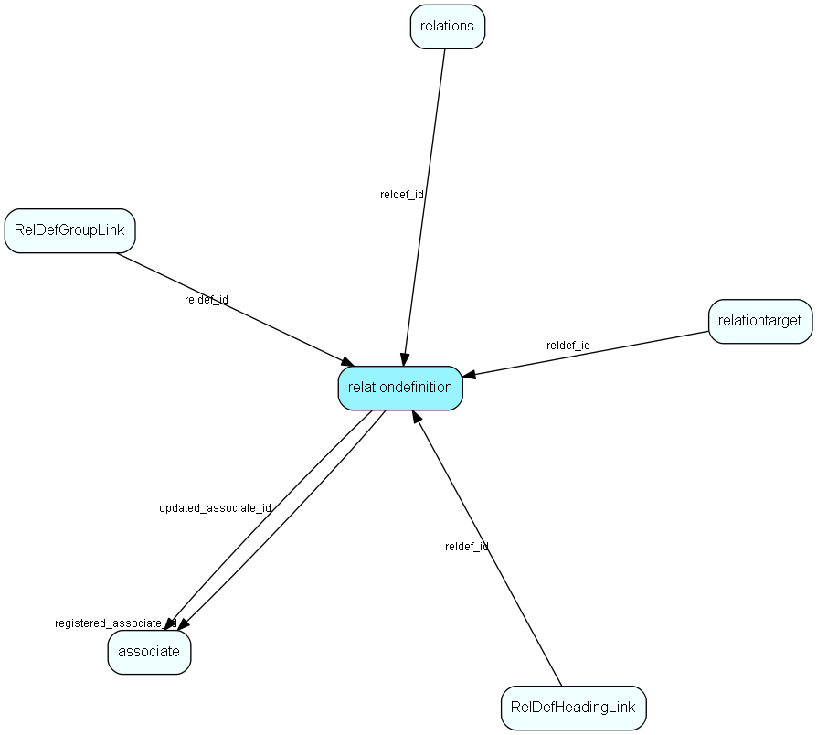

# relationdefinition Table (48)

Definition of a relation. This table defines the relations that can exist in the database. Each relation has an active text and a passive text. The table RelationTarget specifies which pairs of tables this relation can connect.  Use of the active and passive texts is dependent on which direction the relation is viewed in, e.g., active text = &quot;Owns&quot; and passive text = &quot;Is owned by&quot;.

## Fields

| Name | Description | Type | Null |
|------|-------------|------|:----:|
|reldef\_id|Primary key|PK| |
|name|Active text|String(239)|&#x25CF;|
|rank|Rank order |UShort|&#x25CF;|
|tooltip|Tooltip or other description|String(254)|&#x25CF;|
|deleted|0 -&gt; record is active 1 -&gt; record is &apos;deleted&apos; and should not be shown in lists|UShort|&#x25CF;|
|passive\_text|Text used in passive direction|String(254)|&#x25CF;|
|defcomment|Comment|String(254)|&#x25CF;|
|registered|Registered when|UtcDateTime| |
|registered\_associate\_id|Registered by whom|FK [associate](associate.md)| |
|updated|Last updated when|UtcDateTime| |
|updated\_associate\_id|Last updated by whom|FK [associate](associate.md)| |
|updatedCount|Number of updates made to this record|UShort| |

[!include[details](./includes/relationdefinition.md)]

## Indexes

| Fields | Types | Description |
|--------|-------|-------------|
|reldef\_id |PK |Clustered, Unique |

## Relationships

| Table|  Description |
|------|-------------|
|[associate](associate.md)  |Employees, resources and other users - except for External persons |
|[relations](relations.md)  |Instance of a relation, in principle between any two records, as long as they are defined in RelationDefinition. All instances of relations are held in this table; their definitions are in the RelDef table (RelDef + RelTarg define which relations you can have, this table contains the relations the user has actually entered). From 6.1 all links between appointments, sales and documents are also stored in this tabel. |
|[relationtarget](relationtarget.md)  |Definition of targets for a relation. Links a relation definition (RelDef) to source and target tables. In general, a relation can be created between any pair of tables. This table is used for specifying which table pairs a particular relation can be used for. A relation definition should have at least one row in this table, and can have more. Note: The 5.0 Maintenance and GUI only support contact and person as valid values for the source_table and destination_table fields, in any combination. Other relations will not be shown, and relation definitions pointing to other tables will not be editable from the Maintenance GUI; however, nothing will crash. |
|[RelDefGroupLink](reldefgrouplink.md)  |User group link table for RelDef, for MDO item hiding |
|[RelDefHeadingLink](reldefheadinglink.md)  |Heading link table for RelDef, for MDO headers |

## Replication Flags

* Replicate changes DOWN from central to satellites and travellers.
* Replicate changes UP from satellites and travellers back to central.
* Copy to satellite and travel prototypes.

## Security Flags

* No access control via user's Role.

