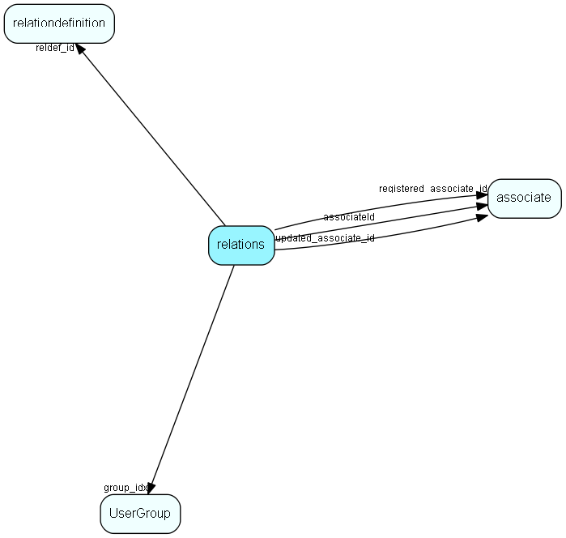

# relations Table (52)

Instance of a relation, in principle between any two records, as long as they are defined in RelationDefinition. All instances of relations are held in this table; their definitions are in the RelDef table (RelDef + RelTarg define which relations you can have, this table contains the relations the user has actually entered). From 6.1 all links between appointments, sales and documents are also stored in this tabel.

## Fields

| Name | Description | Type | Null |
|------|-------------|------|:----:|
|relation\_id|Primary key|PK| |
|reldef\_id|Reference to definition|FK [relationdefinition](relationdefinition.md)| |
|source\_table|Actual source table|TableNumber| |
|source\_record|Actual source record|RecordId| |
|destination\_table|Actual target table|TableNumber| |
|destination\_record|Actual target record|RecordId| |
|relcomment|Comment for relation|String(254)|&#x25CF;|
|reversed|Is direction reversed relative to definition|UShort|&#x25CF;|
|group\_idx|User group owning this relation|FK [UserGroup](usergroup.md)|&#x25CF;|
|startDate|Start date of validity|DateTime|&#x25CF;|
|endDate|End date of validity|DateTime|&#x25CF;|
|relFlags|Relation flags, meaning as yet unspecified|UInt|&#x25CF;|
|registered|Registered when|UtcDateTime| |
|registered\_associate\_id|Registered by whom|FK [associate](associate.md)| |
|updated|Last updated when|UtcDateTime| |
|updated\_associate\_id|Last updated by whom|FK [associate](associate.md)| |
|updatedCount|Number of updates made to this record|UShort| |
|associateId|Owner of this relation record|FK [associate](associate.md)| |

[!include[details](./includes/relations.md)]

## Indexes

| Fields | Types | Description |
|--------|-------|-------------|
|relation\_id |PK |Clustered, Unique |
|reldef\_id |FK |Index |
|source\_table |TableNumber |Index |
|source\_record |RecordId |Index |
|destination\_table |TableNumber |Index |
|destination\_record |RecordId |Index |
|reversed |UShort |Index |
|source\_table, source\_record, reversed |TableNumber, RecordId, UShort |Index |
|destination\_table, destination\_record, reversed |TableNumber, RecordId, UShort |Index |

## Relationships

| Table|  Description |
|------|-------------|
|[associate](associate.md)  |Employees, resources and other users - except for External persons |
|[relationdefinition](relationdefinition.md)  |Definition of a relation. This table defines the relations that can exist in the database. Each relation has an active text and a passive text. The table RelationTarget specifies which pairs of tables this relation can connect.  Use of the active and passive texts is dependent on which direction the relation is viewed in, e.g., active text = &quot;Owns&quot; and passive text = &quot;Is owned by&quot;. |
|[UserGroup](usergroup.md)  |Secondary user groups |

## Replication Flags

* Area Management controlled table. Contents replicated to satellites and traveller databases.
* Replicate changes UP from satellites and travellers back to central.
* Copy to satellite and travel prototypes.

## Security Flags

* Sentry controls access to items in this table using user's Role and data rights matrix.

