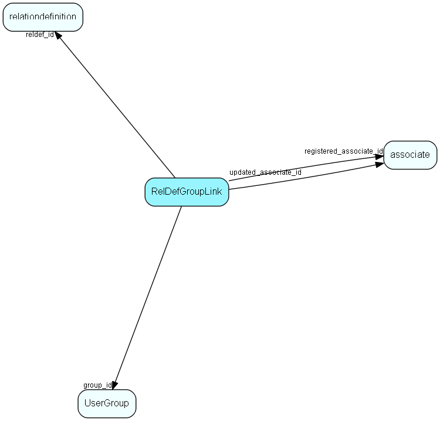

# RelDefGroupLink Table (49)

User group link table for RelDef, for MDO item hiding

## Fields

| Name | Description | Type | Null |
|------|-------------|------|:----:|
|reldefgrouplink\_id|Primary key|PK| |
|reldef\_id|Link to RelDef list table|FK [relationdefinition](relationdefinition.md)| |
|group\_id|Link to Group table|FK [UserGroup](usergroup.md)| |
|registered|Registered when|UtcDateTime| |
|registered\_associate\_id|Registered by whom|FK [associate](associate.md)| |
|updated|Last updated when|UtcDateTime| |
|updated\_associate\_id|Last updated by whom|FK [associate](associate.md)| |
|updatedCount|Number of updates made to this record|UShort| |

[!include[details](./includes/reldefgrouplink.md)]

## Indexes

| Fields | Types | Description |
|--------|-------|-------------|
|reldefgrouplink\_id |PK |Clustered, Unique |
|reldef\_id |FK |Index |
|group\_id |FK |Index |

## Relationships

| Table|  Description |
|------|-------------|
|[associate](associate.md)  |Employees, resources and other users - except for External persons |
|[relationdefinition](relationdefinition.md)  |Definition of a relation. This table defines the relations that can exist in the database. Each relation has an active text and a passive text. The table RelationTarget specifies which pairs of tables this relation can connect.  Use of the active and passive texts is dependent on which direction the relation is viewed in, e.g., active text = &quot;Owns&quot; and passive text = &quot;Is owned by&quot;. |
|[UserGroup](usergroup.md)  |Secondary user groups |

## Replication Flags

* Replicate changes DOWN from central to satellites and travellers.
* Replicate changes UP from satellites and travellers back to central.
* Copy to satellite and travel prototypes.

## Security Flags

* No access control via user's Role.

