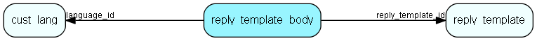

# reply\_template\_body Table (279)

Contains the body of the reply templates in different languages

## Fields

| Name | Description | Type | Null |
|------|-------------|------|:----:|
|id|The primary key (auto-incremented)|PK| |
|reply\_template\_id|Links the body to a reply template|FK [reply_template](reply-template.md)| |
|language\_id|Links the body to a reply template|FK [cust_lang](cust-lang.md)| |
|flags|Identifies the status of the template body. Default, not default etc.|Enum [ReplyTemplateBodyFlags](enums/replytemplatebodyflags.md)| |
|body\_plain|The plain text version of the body.|Clob|&#x25CF;|
|body\_html|The html version of the body.|Clob|&#x25CF;|
|subject|Subject of the outgoing message. Ignored if not needed|Clob|&#x25CF;|
|headers|Additional headers. Optional|Clob|&#x25CF;|
|body\_sms|The sms version of the body.|Clob|&#x25CF;|

[!include[details](./includes/reply-template-body.md)]

## Indexes

| Fields | Types | Description |
|--------|-------|-------------|
|id |PK |Clustered, Unique |
|reply\_template\_id |FK |Index |
|language\_id |FK |Index |

## Relationships

| Table|  Description |
|------|-------------|
|[cust\_lang](cust-lang.md)  |This table contains entries for customer languages. |
|[reply\_template](reply-template.md)  |Templates for automatic and manual replies to emails/sms organized hierachically |

## Replication Flags

* None

## Security Flags

* No access control via user's Role.

