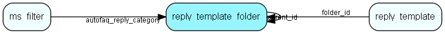

# reply\_template\_folder Table (276)

This table contains entries for folders for reply templates.

## Fields

| Name | Description | Type | Null |
|------|-------------|------|:----:|
|id|The primary key (auto-incremented)|PK| |
|parent\_id|The id of the parent folder of this folder. NULL or -1 of this is a toplevel folder.|FK [reply_template_folder](reply-template-folder.md)| |
|name|The name of this folder.|String(64)| |
|description|The description of this folder.|String(255)|&#x25CF;|
|flags|A bitmap for this folder.|Int|&#x25CF;|
|fullname|The full name of this folder , i.e. Foo/bar/test.|Clob|&#x25CF;|

[!include[details](./includes/reply-template-folder.md)]

## Indexes

| Fields | Types | Description |
|--------|-------|-------------|
|id |PK |Clustered, Unique |
|parent\_id |FK |Index |
|name |String(64) |Index |

## Relationships

| Table|  Description |
|------|-------------|
|[ms\_filter](ms-filter.md)  |This table contains email filters. These are the filters allowing you to do advanced parsing of incomming emails. |
|[reply\_template](reply-template.md)  |Templates for automatic and manual replies to emails/sms organized hierachically |
|[reply\_template\_folder](reply-template-folder.md)  |This table contains entries for folders for reply templates. |

## Replication Flags

* None

## Security Flags

* No access control via user's Role.

