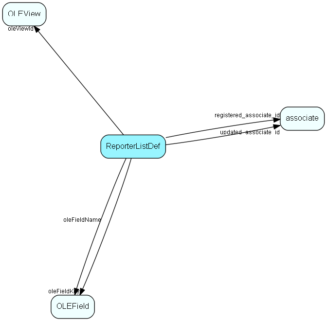

# ReporterListDef Table (170)

Reporter definitions

## Fields

| Name | Description | Type | Null |
|------|-------------|------|:----:|
|ReporterListDef\_id|Primary key|PK| |
|oleViewId|OLE View link|FK [OLEView](oleview.md)| |
|oleFieldKey|OLE Field link|FK [OLEField](olefield.md)| |
|oleFieldName|OLE Field link|FK [OLEField](olefield.md)| |
|listSource|Source table name|String(254)| |
|registered|Registered when|UtcDateTime| |
|registered\_associate\_id|Registered by whom|FK [associate](associate.md)| |
|updated|Last updated when|UtcDateTime| |
|updated\_associate\_id|Last updated by whom|FK [associate](associate.md)| |
|updatedCount|Number of updates made to this record|UShort| |

[!include[details](./includes/reporterlistdef.md)]

## Indexes

| Fields | Types | Description |
|--------|-------|-------------|
|ReporterListDef\_id |PK |Clustered, Unique |
|oleViewId |FK |Index |
|oleFieldKey |FK |Index |
|oleFieldName |FK |Index |

## Relationships

| Table|  Description |
|------|-------------|
|[associate](associate.md)  |Employees, resources and other users - except for External persons |
|[OLEField](olefield.md)  |Control data table for the OLE DB Provider |
|[OLEView](oleview.md)  |Control data table for the OLE DB Provider |

## Replication Flags

* Replicate changes DOWN from central to satellites and travellers.
* Copy to satellite and travel prototypes.

## Security Flags

* No access control via user's Role.

