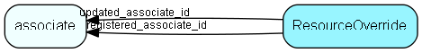

# ResourceOverride Table (448)

Generic mechanism for overriding (or even defining new) text resources, in multiple languages

## Fields

| Name | Description | Type | Null |
|------|-------------|------|:----:|
|resourceoverride\_id|Primary key|PK| |
|ResourceName|The name of the resource, without any brackets or braces - example: SR_CONTACT|String(254)|&#x25CF;|
|Culture|.NET-style culture code, such as NB-NO or EN-UK|String(9)|&#x25CF;|
|ResourceValue|The value of the resource in the given culture|String(2047)|&#x25CF;|
|IsActive|Is this override active|Bool|&#x25CF;|
|registered|Registered when|UtcDateTime|&#x25CF;|
|registered\_associate\_id|Registered by whom|FK [associate](associate.md)|&#x25CF;|
|updated|Last updated when|UtcDateTime|&#x25CF;|
|updated\_associate\_id|Last updated by whom|FK [associate](associate.md)|&#x25CF;|
|updatedCount|Number of updates made to this record|UShort|&#x25CF;|

[!include[details](./includes/resourceoverride.md)]

## Indexes

| Fields | Types | Description |
|--------|-------|-------------|
|resourceoverride\_id |PK |Unique |
|ResourceName, Culture |String(254), String(9) |Clustered, Unique |

## Relationships

| Table|  Description |
|------|-------------|
|[associate](associate.md)  |Employees, resources and other users - except for External persons |

## Replication Flags

* Replicate changes DOWN from central to satellites and travellers.
* Replicate changes UP from satellites and travellers back to central.
* Copy to satellite and travel prototypes.

## Security Flags

* No access control via user's Role.

