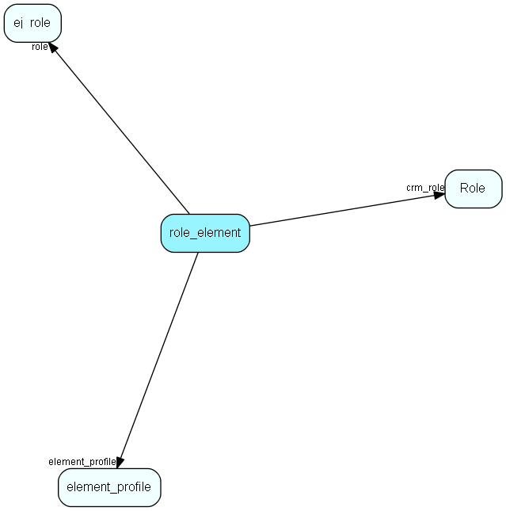

# role\_element Table (326)

Profiles associated with a role

## Fields

| Name | Description | Type | Null |
|------|-------------|------|:----:|
|id|The primary key (auto-incremented)|PK| |
|role|The id of the group. Deprecated.|FK [ej_role](ej-role.md)| |
|element\_profile|The id of the element_profile.|FK [element_profile](element-profile.md)| |
|crm\_role|Link to Role|FK [Role](role.md)|&#x25CF;|

[!include[details](./includes/role-element.md)]

## Indexes

| Fields | Types | Description |
|--------|-------|-------------|
|id |PK |Clustered, Unique |
|role |FK |Index |
|element\_profile |FK |Index |
|crm\_role |FK |Index |

## Relationships

| Table|  Description |
|------|-------------|
|[ej\_role](ej-role.md)  |Define access rights, memberships and other properties for role user members |
|[element\_profile](element-profile.md)  |The new (4.0) profile table. Contains profile for a single Html-element. Connected through element_profile_link |
|[Role](role.md)  |User roles for role-based security, names and tooltips are in LocaleText. For more information regarding role based security, see http://techdoc.superoffice.com |

## Replication Flags

* None

## Security Flags

* No access control via user's Role.

