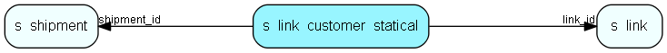

# s\_link\_customer\_statical Table (338)

A connection between a customer and a link. Registered customers are identified when clicking on a link

## Fields

| Name | Description | Type | Null |
|------|-------------|------|:----:|
|id|Primary key|PK| |
|email|The email address of the bounced email|String(255)| |
|link\_id|Connection to a link that the customer clicked on|FK [s_link](s-link.md)| |
|shipment\_id|Which shipment the customer received.|FK [s_shipment](s-shipment.md)| |
|pressed|When the link was clicked.|DateTime|&#x25CF;|
|link\_type|If this is a link to a link or an image (gif/jpeg). See SpmLink::LinkType|Enum [ShipmentLinkType](enums/shipmentlinktype.md)| |
|page|Indicates the page number for this gif link|Int| |
|http\_user\_agent|The HTTP_USER_AGENT reported when the customer opened this link|String(1024)|&#x25CF;|

[!include[details](./includes/s-link-customer-statical.md)]

## Indexes

| Fields | Types | Description |
|--------|-------|-------------|
|id |PK |Clustered, Unique |
|email |String(255) |Index |
|link\_id |FK |Index |
|shipment\_id |FK |Index |
|link\_type |Enum |Index |
|shipment\_id, email |FK, String(255) |Index |
|link\_type, shipment\_id |Enum, FK |Index |

## Relationships

| Table|  Description |
|------|-------------|
|[s\_link](s-link.md)  |Links in messages to measure success rate of a campaign. |
|[s\_shipment](s-shipment.md)  |Contains info about one shipment. The addresses are stored in s_shipment_addr |

## Replication Flags

* None

## Security Flags

* No access control via user's Role.

