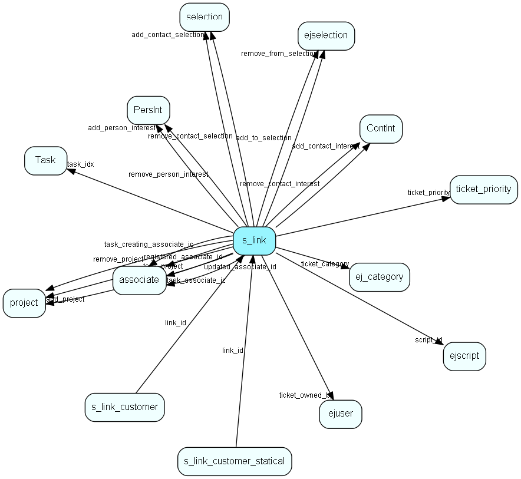

# s\_link Table (336)

Links in messages to measure success rate of a campaign.

## Fields

| Name | Description | Type | Null |
|------|-------------|------|:----:|
|id|Primary key|PK| |
|url|The real URL of this link (www.vg.no etc)|String(4000)| |
|hits|Number of clicks on this link|Int|&#x25CF;|
|description|A short description of this link|String(255)|&#x25CF;|
|last\_reset|The time of last reset.|DateTime|&#x25CF;|
|status|Deleted or not. Deleted links should still work.|status|&#x25CF;|
|extra\_field|The name of the extra field to set if the customer clicks a link. empty if no extra field|String(255)|&#x25CF;|
|value|The value of the extra field to set if the customer clicks a link.|String(255)|&#x25CF;|
|folder\_id|The folder which this link belongs to. -1 indicates that the link is on the root|Int| |
|script\_id|The ejScript which will be run when the link is clicked. -1 means no script is run|FK [ejscript](ejscript.md)| |
|ticket\_title|The title on the ticket if the clicks results in creating a request.|String(255)|&#x25CF;|
|ticket\_category|The id of the category a ticket is in.|FK [ej_category](ej-category.md)| |
|ticket\_priority|The reference to the ticket_priority table.|FK [ticket_priority](ticket-priority.md)| |
|ticket\_owned\_by|The id of the user who owns the ticket. 1 (system user) if the ticket is unassigned.|FK [ejuser](ejuser.md)| |
|remove\_from\_selection|The id of the selection that the customer shall be removed from|FK [ejselection](ejselection.md)| |
|add\_to\_selection|The id of the selection that the customer shall be added to|FK [ejselection](ejselection.md)| |
|template\_text|Text to print when link is clicked.|Clob|&#x25CF;|
|action\_flags|Bitmask defining what action should be taken|Enum [ShipmentLinkAction](enums/shipmentlinkaction.md)|&#x25CF;|
|add\_contact\_interest|Contact interest to add to recipient person|FK [ContInt](contint.md)|&#x25CF;|
|remove\_contact\_interest|Person interest to remove from recipient person|FK [ContInt](contint.md)|&#x25CF;|
|add\_person\_interest|Person interest to add to recipient person|FK [PersInt](persint.md)|&#x25CF;|
|remove\_person\_interest|Person interest to remove from recipient person|FK [PersInt](persint.md)|&#x25CF;|
|add\_contact\_selection|Static contact selection to add person to|FK [selection](selection.md)|&#x25CF;|
|remove\_contact\_selection|Static contact selection to remove person from|FK [selection](selection.md)|&#x25CF;|
|add\_project|Project to add person to, as member|FK [project](project.md)|&#x25CF;|
|remove\_project|Project to remove person from, as member|FK [project](project.md)|&#x25CF;|
|task\_text|Text of task to be created|String(2047)|&#x25CF;|
|task\_idx|Task type of new task|FK [Task](task.md)|&#x25CF;|
|task\_flags|Flags that control how the task is created|Enum [ShipmentLinkTaskFlags](enums/shipmentlinktaskflags.md)|&#x25CF;|
|task\_associate\_id|Associate whose diary should receive the task or assignment (unless AssignToOurContact is specified)|FK [associate](associate.md)|&#x25CF;|
|task\_creating\_associate\_id|Associate who should stand as creator of task; also works as fallback if an assigned task is rejected. Usually the associate who ordered the shipment|FK [associate](associate.md)|&#x25CF;|
|task\_project|Project to connect task to, can be 0|FK [project](project.md)|&#x25CF;|
|task\_start|Start time of task, unless UseNextAvailableTime is specified|DateTime|&#x25CF;|
|task\_duration|Task duration in minutes|Int|&#x25CF;|
|registered|Registered when|UtcDateTime|&#x25CF;|
|registered\_associate\_id|Registered by whom|FK [associate](associate.md)|&#x25CF;|
|updated|Last updated when|UtcDateTime|&#x25CF;|
|updated\_associate\_id|Last updated by whom|FK [associate](associate.md)|&#x25CF;|
|updatedCount|Number of updates made to this record|UShort|&#x25CF;|
|local\_link|If this references a shipment message, then this is a local link belonging to that message|FK [s_message](s-message.md)|&#x25CF;|
|redirect\_kind|Enum defining the redirect kind (show text, url, etc) of the link|Enum [ShipmentLinkRedirectKind](enums/shipmentlinkredirectkind.md)|&#x25CF;|
|link\_parameters|Contains parameters that will be added to the link when it is used|Clob|&#x25CF;|
|form\_id|Relation to the form this link redirects to|FK [form](form.md)|&#x25CF;|
|form\_parameters|Contains url parameters that will be added when link is inserted in message|String(4000)|&#x25CF;|

[!include[details](./includes/s-link.md)]

## Indexes

| Fields | Types | Description |
|--------|-------|-------------|
|id |PK |Clustered, Unique |
|script\_id |FK |Index |
|ticket\_category |FK |Index |
|ticket\_priority |FK |Index |
|ticket\_owned\_by |FK |Index |
|remove\_from\_selection |FK |Index |
|add\_to\_selection |FK |Index |
|add\_contact\_interest |FK |Index |
|remove\_contact\_interest |FK |Index |
|add\_person\_interest |FK |Index |
|remove\_person\_interest |FK |Index |
|add\_contact\_selection |FK |Index |
|remove\_contact\_selection |FK |Index |
|add\_project |FK |Index |
|remove\_project |FK |Index |
|task\_idx |FK |Index |
|task\_associate\_id |FK |Index |
|task\_creating\_associate\_id |FK |Index |
|task\_project |FK |Index |

## Relationships

| Table|  Description |
|------|-------------|
|[associate](associate.md)  |Employees, resources and other users - except for External persons |
|[ContInt](contint.md)  |ContInt list table. List-text of all valid contact interest types. |
|[ej\_category](ej-category.md)  |This table contains categories, in which tickets are categorized. The categories are organized in a hierarchial manner. |
|[ejscript](ejscript.md)  |ejscript |
|[ejselection](ejselection.md)  |This table stores selections, dynamic groups. |
|[ejuser](ejuser.md)  |This table contains entries for the users of the system. |
|[email\_flow\_content\_link](email-flow-content-link.md)  |Links content to an email workflow |
|[form](form.md)  |A form which can be published on a webpage and submitted by visitors |
|[PersInt](persint.md)  |PersInt list table. List of Person interests. |
|[project](project.md)  |Projects |
|[s\_link\_customer](s-link-customer.md)  |A connection between a customer and a link. Registered customers are identified when clicking on a link |
|[s\_link\_customer\_statical](s-link-customer-statical.md)  |A connection between a customer and a link. Registered customers are identified when clicking on a link |
|[s\_message](s-message.md)  |A message used in a shipment. Can be html and/or plain text |
|[selection](selection.md)  |Selections |
|[Task](task.md)  |Task list table, activity types, like Phone, Meeting |
|[ticket\_priority](ticket-priority.md)  |This table contains the ticket priorities. |

## Replication Flags

* None

## Security Flags

* No access control via user's Role.

