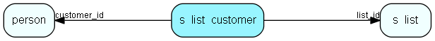

# s\_list\_customer Table (346)

Elements in a customer list.

## Fields

| Name | Description | Type | Null |
|------|-------------|------|:----:|
|id|Primary key|PK| |
|list\_id|Which list this element belongs to|FK [s_list](s-list.md)| |
|customer\_id||FK [person](person.md)| |

[!include[details](./includes/s-list-customer.md)]

## Indexes

| Fields | Types | Description |
|--------|-------|-------------|
|id |PK |Clustered, Unique |
|list\_id |FK |Index |
|customer\_id |FK |Index |

## Relationships

| Table|  Description |
|------|-------------|
|[person](person.md)  |Persons in a company or an organizations. All associates have a corresponding person record |
|[s\_list](s-list.md)  |A list, dynamic or static |

## Replication Flags

* None

## Security Flags

* No access control via user's Role.

