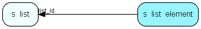

# s\_list\_element Table (345)

Elements in a static list.

## Fields

| Name | Description | Type | Null |
|------|-------------|------|:----:|
|id|Primary key|PK| |
|list\_id|Which list this element belongs to|FK [s_list](s-list.md)| |
|address|The email address of this element|String(255)| |
|name|The name of the recipient|String(255)|&#x25CF;|
|sms|The sms number for this element|String(255)| |
|status|Status for the statical list element|Enum [ElementStatus](enums/elementstatus.md)| |

[!include[details](./includes/s-list-element.md)]

## Indexes

| Fields | Types | Description |
|--------|-------|-------------|
|id |PK |Clustered, Unique |
|list\_id |FK |Index |
|address |String(255) |Index |
|sms |String(255) |Index |

## Relationships

| Table|  Description |
|------|-------------|
|[s\_list](s-list.md)  |A list, dynamic or static |

## Replication Flags

* None

## Security Flags

* No access control via user's Role.

