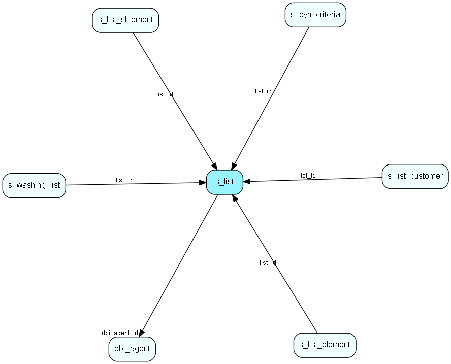

# s\_list Table (344)

A list, dynamic or static

## Fields

| Name | Description | Type | Null |
|------|-------------|------|:----:|
|id|Primary key|PK| |
|type|Dynamic/static|type| |
|name|The name of the list|String(255)| |
|washed|Date when this list was last washed(not used until v2)|DateTime|&#x25CF;|
|washing\_percent|How far the washing has gotten (not used until v2)|Short|&#x25CF;|
|flag|Not used|Short|&#x25CF;|
|number\_of\_elements|How many elements this list contains|Int|&#x25CF;|
|folder\_id|The folder which this link belongs to. -1 indicates that the link is on the root|Int| |
|dbi\_agent\_id|Integration agent (eJournal)|FK [dbi_agent](dbi-agent.md)| |
|dbi\_key|The primary key for the integrated entry in the external datasource.|String(255)| |
|dbi\_last\_syncronized|Last external syncronization.|DateTime| |
|dbi\_last\_modified|When the entry was last modified.|DateTime| |

[!include[details](./includes/s-list.md)]

## Indexes

| Fields | Types | Description |
|--------|-------|-------------|
|id |PK |Clustered, Unique |
|dbi\_agent\_id |FK |Index |
|dbi\_key |String(255) |Index |
|dbi\_last\_syncronized |DateTime |Index |
|dbi\_last\_modified |DateTime |Index |

## Relationships

| Table|  Description |
|------|-------------|
|[dbi\_agent](dbi-agent.md)  |DBI agent settings |
|[s\_dyn\_criteria](s-dyn-criteria.md)  |Contains criterias for a dynamic list. |
|[s\_list\_customer](s-list-customer.md)  |Elements in a customer list. |
|[s\_list\_element](s-list-element.md)  |Elements in a static list. |
|[s\_list\_shipment](s-list-shipment.md)  |A connector between shipment and list so that one shipment can have many lists, and one list can have many shipments |
|[s\_washing\_list](s-washing-list.md)  |Unused table that is ment to be used for active washing in spm v2 |

## Replication Flags

* None

## Security Flags

* No access control via user's Role.

