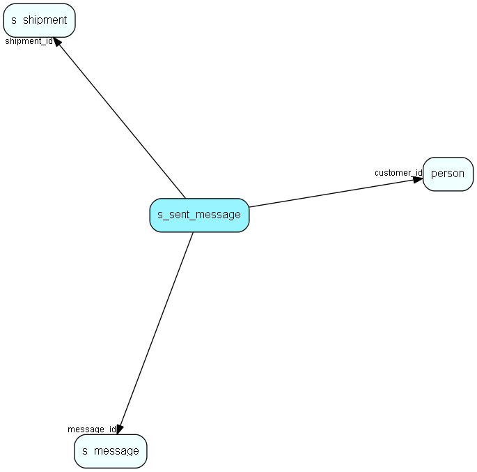

# s\_sent\_message Table (405)

Emarketeer message control

## Fields

| Name | Description | Type | Null |
|------|-------------|------|:----:|
|id|The primary key (auto-incremented)|PK| |
|shipment\_id|Which shipment the customer received.|FK [s_shipment](s-shipment.md)| |
|message\_id|The id of the message that is sent in this shipment|FK [s_message](s-message.md)| |
|customer\_id|The id of the customer that received the message|FK [person](person.md)| |
|email|The email-adresse the received the message|String(255)|&#x25CF;|
|when\_sent|When the email was sent.|DateTime|&#x25CF;|
|when\_read|When the email was read or link was clicked.|DateTime|&#x25CF;|

[!include[details](./includes/s-sent-message.md)]

## Indexes

| Fields | Types | Description |
|--------|-------|-------------|
|id |PK |Clustered, Unique |
|shipment\_id |FK |Index |
|message\_id |FK |Index |
|customer\_id |FK |Index |

## Relationships

| Table|  Description |
|------|-------------|
|[person](person.md)  |Persons in a company or an organizations. All associates have a corresponding person record |
|[s\_message](s-message.md)  |A message used in a shipment. Can be html and/or plain text |
|[s\_shipment](s-shipment.md)  |Contains info about one shipment. The addresses are stored in s_shipment_addr |

## Replication Flags

* None

## Security Flags

* No access control via user's Role.

