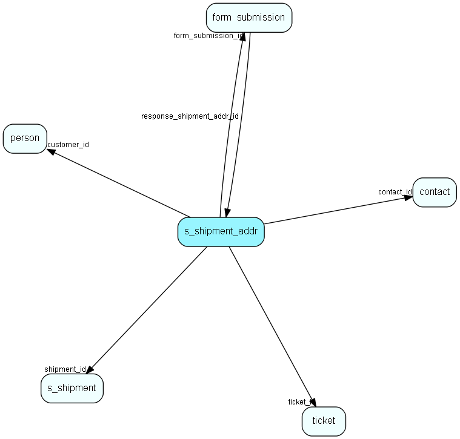

# s\_shipment\_addr Table (347)

Addresses that are ready to be sent in a shipment.

## Fields

| Name | Description | Type | Null |
|------|-------------|------|:----:|
|id|Primary key|PK| |
|shipment\_id|Which shipment this address belongs to|FK [s_shipment](s-shipment.md)| |
|address|The email address|String(255)| |
|name|The name of the recipient|String(255)|&#x25CF;|
|timestamp|A stamp set when this address it taken by ejSender to prevent two ejSenders to take one address.|Int|&#x25CF;|
|customer\_id|Id of the customer if this entry is created by a dynamic list|FK [person](person.md)| |
|type|Indicates if this is an email or a sms|Int|&#x25CF;|
|sender\_nr|Used for multiple ejSenders. This field indicate which ejSender process this belongs to|Int|&#x25CF;|
|ticket\_id|Id of the ticket if this entry is created by a ticketSelection list|FK [ticket](ticket.md)| |
|status|Status for sending to this particular recipient|Enum [ShipmentAddrStatus](enums/shipmentaddrstatus.md)|&#x25CF;|
|contact\_id|Id of contact bound to shipment address|FK [contact](contact.md)|&#x25CF;|
|sending\_time|Estimated or actual sent time (depends on status)|DateTime|&#x25CF;|
|bounce\_reason|Reason text received from mailing system|String(1023)|&#x25CF;|
|form\_submission\_id|If this mailing recipient is created from a form submission, this will contain a reference to that submission|FK [form_submission](form-submission.md)|&#x25CF;|
|bounce\_code|If this recipient bounced and we have a bounce code, this field will contain the code|Int|&#x25CF;|
|bounce\_reasontag|If this recipient bounced and we have a bounce reason, this field will contain the reason|String(4000)|&#x25CF;|
|cleaned|Used for indicating that a bounced recipient row has been cleaned, and now will not be presented again in the cleaning list|Bool|&#x25CF;|
|workflow\_step\_id|The row was created by this workflow step|FK [workflow_step](workflow-step.md)|&#x25CF;|
|workflow\_instance\_id|The row was created by this workflow instance|FK [workflow_instance](workflow-instance.md)|&#x25CF;|

[!include[details](./includes/s-shipment-addr.md)]

## Indexes

| Fields | Types | Description |
|--------|-------|-------------|
|id |PK |Clustered, Unique |
|shipment\_id |FK |Index |
|address |String(255) |Index |
|customer\_id |FK |Index |
|ticket\_id |FK |Index |
|contact\_id |FK |Index |
|status, shipment\_id |Enum, FK |Index |
|workflow\_instance\_id |FK |Index |
|workflow\_step\_id |FK |Index |

## Relationships

| Table|  Description |
|------|-------------|
|[contact](contact.md)  |Companies and Organizations.   This table features a special record containing information about the contact that owns the database.   |
|[form\_submission](form-submission.md)  |A form submission |
|[person](person.md)  |Persons in a company or an organizations. All associates have a corresponding person record |
|[s\_shipment](s-shipment.md)  |Contains info about one shipment. The addresses are stored in s_shipment_addr |
|[ticket](ticket.md)  |This table contains the tickets (requests) of the system. Its purpose should be evident. |
|[workflow\_instance](workflow-instance.md)  |A set of properties related to the workflow instance of one participant going through the flow |
|[workflow\_step](workflow-step.md)  |A set of steps related to a workflow. |

## Replication Flags

* None

## Security Flags

* No access control via user's Role.

