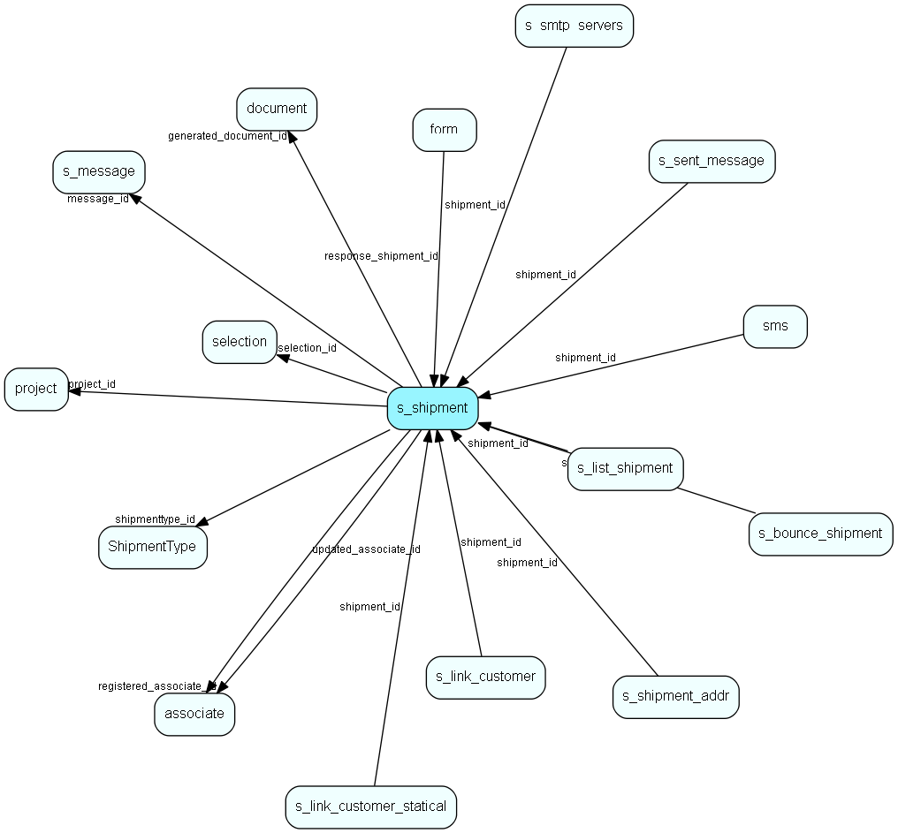

# s\_shipment Table (334)

Contains info about one shipment. The addresses are stored in s_shipment_addr

## Fields

| Name | Description | Type | Null |
|------|-------------|------|:----:|
|id|Primary key|PK| |
|description|Describes the shipment|String(255)|&#x25CF;|
|message\_id|The id of the message that is sent in this shipment|FK [s_message](s-message.md)| |
|start\_date|The date and time when to start this shipment|DateTime|&#x25CF;|
|end\_date|Is set when this shipment is ended|DateTime|&#x25CF;|
|from\_addr|Email address to put in the From header of the messages|String(255)| |
|reply\_addr|Email address to put in the Reply To: header of the messages|String(255)|&#x25CF;|
|envelope\_from|Email address for the MTA envelope (where bounces are returned)|String(255)|&#x25CF;|
|smtp\_serv|The server to use for this shipment.|String(255)|&#x25CF;|
|smtp\_port|The port of the SMTP server to use for this shipment.|Int| |
|send\_rate|Maximum number of messages sent per minute. |Int| |
|status|Sending/stopped/failed etc.|Enum [ShipmentStatus](enums/shipmentstatus.md)| |
|recipients|The total number of recipients to send message to.|Int| |
|actual\_rate|The actual rate of messages per minute. can be lower than send_rate|Int| |
|actual\_time|The time of the last checkpoint|DateTime|&#x25CF;|
|actual\_count|Number of emails sent at the last checkpoint|Int| |
|current\_sender|Timestamp to identify which ejsender that owns this shipment|Int|&#x25CF;|
|ticket\_owner|The owner of the ticket if any is created while sending out a shipment. -1 if no ticket should be automatically delegated, 1 if the ticket is unassigned, &amp;gt;1 for all others|Int|&#x25CF;|
|ticket\_category|The category of tickets created while sending out if any. -1 if no ticket should be created|Int|&#x25CF;|
|flags|Various flags for a shipment|UInt|&#x25CF;|
|folder\_id|The folder which this shipment belongs to. -1 indicates that the shipment is on the root|Int| |
|configuration|This field indicates what kind of shipment this is.|Int| |
|selection\_id|Set if this shipment should be related to a Selection|FK [selection](selection.md)|&#x25CF;|
|project\_id|Set if this shipment should be related to a Project|FK [project](project.md)|&#x25CF;|
|generated\_document\_id|ID of the merged document that is the result of the shipment|FK [document](document.md)|&#x25CF;|
|registered|Registered when|UtcDateTime|&#x25CF;|
|registered\_associate\_id|Registered by whom|FK [associate](associate.md)|&#x25CF;|
|updated|Last updated when|UtcDateTime|&#x25CF;|
|updated\_associate\_id|Last updated by whom|FK [associate](associate.md)|&#x25CF;|
|updatedCount|Number of updates made to this record|UShort|&#x25CF;|
|active\_pane|The currently active pane in the mailing wizard|Int|&#x25CF;|
|sorting|Which sorting should be used on the document mailing recipient list, used when generating PDF|Enum [RecipientSorting](enums/recipientsorting.md)| |
|delivered\_num|Number of mails sent minus bounces|Int|&#x25CF;|
|open\_num|Number of opened emails count|Int|&#x25CF;|
|open\_rate|Open rate % (open_num / delivered_num)|Double|&#x25CF;|
|click\_num|Number of links clicked|Int|&#x25CF;|
|click\_rate|Click rate % (click_num / delivered_num)|Double|&#x25CF;|
|hardbounce\_num|Number of hard bounces|Int|&#x25CF;|
|hardbounce\_rate|Hard bounce rate % (hardbounce_num / number_transmitted)|Double|&#x25CF;|
|softbounce\_num|Number of soft bounces|Int|&#x25CF;|
|softbounce\_rate|Soft bounce rate % (softbounce_num / number_transmitted)|Double|&#x25CF;|
|totalbounce\_num|Total number of bounces|Int|&#x25CF;|
|totalbounce\_rate|Total bounce rate % (totalbounce_num / number_transmitted)|Double|&#x25CF;|
|are\_statistics\_dirty|Indicates if shipment needs statistics calculation, set by code that changes the shipment or receives clicks/opens|Bool| |
|sent\_num|Number of mails sent|Int|&#x25CF;|
|shipmenttype\_id|Id of subscriptionType that this shipment has, so we may check for reservations|FK [ShipmentType](shipmenttype.md)|&#x25CF;|

[!include[details](./includes/s-shipment.md)]

## Indexes

| Fields | Types | Description |
|--------|-------|-------------|
|id |PK |Clustered, Unique |
|message\_id |FK |Index |
|are\_statistics\_dirty, id |Bool, PK |Index |

## Relationships

| Table|  Description |
|------|-------------|
|[associate](associate.md)  |Employees, resources and other users - except for External persons |
|[document](document.md)  |Documents, this table is an extension of the Appointment table.  There is always a corresponding appointment record; the relation between appointment and document is navigable in both directions. A document-type appointment record always has a corresponding document record and a record in VisibleFor specifying who may see this.   |
|[form](form.md)  |A form which can be published on a webpage and submitted by visitors |
|[project](project.md)  |Projects |
|[s\_bounce\_shipment](s-bounce-shipment.md)  |Email bounces from customers |
|[s\_link\_customer](s-link-customer.md)  |A connection between a customer and a link. Registered customers are identified when clicking on a link |
|[s\_link\_customer\_statical](s-link-customer-statical.md)  |A connection between a customer and a link. Registered customers are identified when clicking on a link |
|[s\_list\_shipment](s-list-shipment.md)  |A connector between shipment and list so that one shipment can have many lists, and one list can have many shipments |
|[s\_message](s-message.md)  |A message used in a shipment. Can be html and/or plain text |
|[s\_sent\_message](s-sent-message.md)  |Emarketeer message control |
|[s\_shipment\_addr](s-shipment-addr.md)  |Addresses that are ready to be sent in a shipment. |
|[s\_smtp\_servers](s-smtp-servers.md)  |Contains the smtp server for a shipment |
|[selection](selection.md)  |Selections |
|[ShipmentType](shipmenttype.md)  |Shipment type list table. Classification of a mailing, allowing recipients to subscribe to lists |
|[sms](sms.md)  |This table will hold outgoing sms messages when transmitted with WebServices |

## Replication Flags

* None

## Security Flags

* No access control via user's Role.

