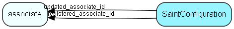

# SaintConfiguration Table (458)

Configuration information for the Saint system

## Fields

| Name | Description | Type | Null |
|------|-------------|------|:----:|
|saintconfiguration\_id|Primary key|PK| |
|ownerTable|The table that is the owning entity|TableNumber| |
|enabled|On/off switch for Saint functionality for this entity|Bool| |
|Period1|Length of the first counter period|Int| |
|Period2|Length of the second counter period|Int| |
|Period3|Length of the third counter period|Int| |
|generationStart|When was the last regeneration started|DateTime|&#x25CF;|
|generationEnd|When was the last regeneration finished|DateTime|&#x25CF;|
|rowsGenerated|Number of CounterValue rows generated for this entity|Int|&#x25CF;|
|registered|Registered when|UtcDateTime| |
|registered\_associate\_id|Registered by whom|FK [associate](associate.md)| |
|updated|Last updated when|UtcDateTime| |
|updated\_associate\_id|Last updated by whom|FK [associate](associate.md)| |
|updatedCount|Number of updates made to this record|UShort| |

[!include[details](./includes/saintconfiguration.md)]

## Indexes

| Fields | Types | Description |
|--------|-------|-------------|
|saintconfiguration\_id |PK |Clustered, Unique |

## Relationships

| Table|  Description |
|------|-------------|
|[associate](associate.md)  |Employees, resources and other users - except for External persons |

## Replication Flags

* Replicate changes DOWN from central to satellites and travellers.
* Copy to satellite and travel prototypes.

## Security Flags

* No access control via user's Role.

