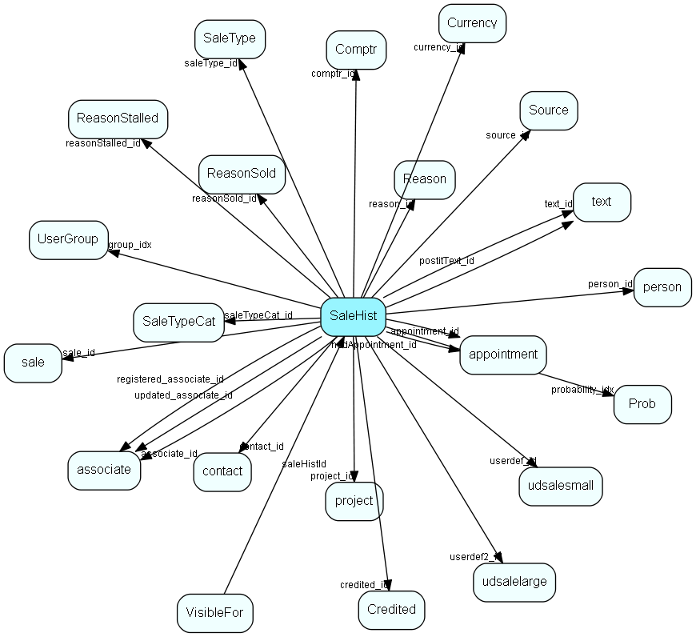

# SaleHist Table (157)

Mirror image of the Sale table, providing a full transaction history. Every time you edit a sale, the current record of the sale is also saved here. 

## Fields

| Name | Description | Type | Null |
|------|-------------|------|:----:|
|salehist\_id|Primary key|PK| |
|sale\_id|The sale|FK [sale](sale.md)| |
|associate\_id|Owning associate|FK [associate](associate.md)| |
|group\_idx|Owner&apos;s group whn sale was created|FK [UserGroup](usergroup.md)| |
|contact\_id|Optional contact reference|FK [contact](contact.md)| |
|person\_id|Optional person reference|FK [person](person.md)|&#x25CF;|
|registered|Registered date|UtcDateTime|&#x25CF;|
|saledate|(expected \| lost \| won) sales date|DateTime| |
|amount|Total sale amount|Double|&#x25CF;|
|probability\_idx|Pointer to probability list value|FK [Prob](prob.md)| |
|appointment\_id|For future use|FK [appointment](appointment.md)| |
|text\_id|Optional long description|FK [text](text.md)|&#x25CF;|
|project\_id|Optional project reference|FK [project](project.md)| |
|earning|Earning on sale|Double|&#x25CF;|
|earning\_percent|Earning as percent of total|Double|&#x25CF;|
|userdef\_id|User-defined fields reference|FK [udsalesmall](udsalesmall.md)|&#x25CF;|
|userdef2\_id|User-defined fields reference|FK [udsalelarge](udsalelarge.md)|&#x25CF;|
|heading|Sale heading (short description?)|String(219)|&#x25CF;|
|credited\_id|Who is to be credited for the sale|FK [Credited](credited.md)|&#x25CF;|
|source\_id|Source of order|FK [Source](source.md)|&#x25CF;|
|reason\_id|Why we lost it|FK [Reason](reason.md)|&#x25CF;|
|comptr\_id|Competitor|FK [Comptr](comptr.md)|&#x25CF;|
|currency\_id|Currency of sale|FK [Currency](currency.md)|&#x25CF;|
|probability|Actual probability, may differ from the one in the list|UShort|&#x25CF;|
|status|Status (open, closed, lost)|Enum [SaleStatus](enums/salestatus.md)|&#x25CF;|
|done|Done (0=don&apos;t know, 1 = No, 2=Yes)|Enum [SaleDone](enums/saledone.md)|&#x25CF;|
|number1|Alphanumeric user field|String(49)|&#x25CF;|
|visibility|Obsolete, but still maintained denormalization of visiblefor|UShort|&#x25CF;|
|source|For future integration use; source of record|UShort|&#x25CF;|
|registered\_associate\_id|Registered by whom|FK [associate](associate.md)| |
|updated|Last updated|UtcDateTime| |
|updated\_associate\_id|Last updated by whom|FK [associate](associate.md)| |
|updatedCount|Number of updates made to this record|UShort| |
|activeLinks|Number of active links to documents and such|UInt|&#x25CF;|
|saleType\_id|Link to list, sale type (big sale, small sale, no-process sale, ...)|FK [SaleType](saletype.md)|&#x25CF;|
|postitText\_id|Paperclip text|FK [text](text.md)|&#x25CF;|
|reasonStalled\_id|If the status is stalled, it should be commented here|FK [ReasonStalled](reasonstalled.md)|&#x25CF;|
|reopenDate|Date the sale is to be reopened; valid only for status=stalled. Not necessarily the same as the nextDueDate.|DateTime|&#x25CF;|
|nextDueDate|Next due date, this is a denormalization of &apos;closest future activity date, or most recent if no future activities&apos;. Maintained by the system, but very convenient for searching.|DateTime|&#x25CF;|
|nddAppointment\_id|ID, can be 0, of the appointment that &quot;caused&quot; the nextDueDate|FK [appointment](appointment.md)|&#x25CF;|
|reasonSold\_id|Reason why we made the sale|FK [ReasonSold](reasonsold.md)|&#x25CF;|
|saleTypeCat\_id|Category of sale type, slaved from saletype|FK [SaleTypeCat](saletypecat.md)|&#x25CF;|

[!include[details](./includes/salehist.md)]

## Indexes

| Fields | Types | Description |
|--------|-------|-------------|
|salehist\_id |PK |Clustered, Unique |
|sale\_id |FK |Index |
|contact\_id |FK |Index |
|person\_id |FK |Index |
|saledate |DateTime |Index |
|project\_id |FK |Index |
|userdef\_id |FK |Index |
|userdef2\_id |FK |Index |
|heading |String(219) |Index |
|status |Enum |Index |
|done |Enum |Index |
|number1 |String(49) |Index |
|source |UShort |Index |

## Relationships

| Table|  Description |
|------|-------------|
|[appointment](appointment.md)  |Tasks, appointments, followups, phone calls; and documents (document_id != 0). An appointment always has a corresponding record in VisibleFor specifying who may see this.  |
|[associate](associate.md)  |Employees, resources and other users - except for External persons |
|[Comptr](comptr.md)  |Comptr list table. List of all possible competitors (sale). |
|[contact](contact.md)  |Companies and Organizations.   This table features a special record containing information about the contact that owns the database.   |
|[Credited](credited.md)  |Credited list table. List of who is to be credited for the sale. |
|[Currency](currency.md)  |Currency list table |
|[person](person.md)  |Persons in a company or an organizations. All associates have a corresponding person record |
|[Prob](prob.md)  |Prob list table. Probability, used in  sales . |
|[project](project.md)  |Projects |
|[Reason](reason.md)  |Reason list table. Why we lost the sale (list) |
|[ReasonSold](reasonsold.md)  |Why was the sale marked as sold (why did we succeed) |
|[ReasonStalled](reasonstalled.md)  |Why was the sale marked as stalled |
|[sale](sale.md)  |Sales  For every Sale record edited through the SuperOffice GUI, a copy of the current version of the record will be saved in the SaleHist table. This also applies to editing done through the SaleModel COM interface, but not to editing done through the OLE DB Provider or other channels.   |
|[SaleType](saletype.md)  |Type of sale - large solution, incremental, whatever fits the organization |
|[SaleTypeCat](saletypecat.md)  |Category for sale type |
|[Source](source.md)  |Source list table. Source for sale (list) |
|[text](text.md)  |Long text fields from all over the system |
|[udsalelarge](udsalelarge.md)  |User-defined fields |
|[udsalesmall](udsalesmall.md)  |User-defined fields |
|[UserGroup](usergroup.md)  |Secondary user groups |
|[VisibleFor](visiblefor.md)  |Visible for rights, who may see this appointment/document, sale,  salehist or selection |

## Replication Flags

* Area Management controlled table. Contents replicated to satellites and traveller databases.
* Replicate changes UP from satellites and travellers back to central.
* Copy to satellite and travel prototypes.

## Security Flags

* Sentry controls access to items in this table using user's Role and data rights matrix on the table's parent.

