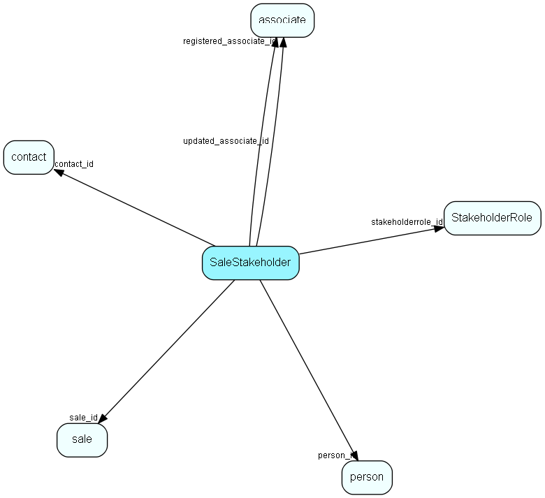

# SaleStakeholder Table (121)

Stakeholders in the sale, very similar to project members

## Fields

| Name | Description | Type | Null |
|------|-------------|------|:----:|
|salestakeholder\_id|Primary key|PK| |
|sale\_id|Parent sale|FK [sale](sale.md)|&#x25CF;|
|contact\_id|Contact ID of person or contact who is the sale stakeholder|FK [contact](contact.md)|&#x25CF;|
|person\_id|Person ID of person who is the sale stakeholder, or 0 if it&apos;s just a contact|FK [person](person.md)|&#x25CF;|
|rank|Rank in list|UShort|&#x25CF;|
|stakeholderrole\_id|Member type link|FK [StakeholderRole](stakeholderrole.md)|&#x25CF;|
|comment|Optional comment|String(2047)|&#x25CF;|
|registered|Registered when|UtcDateTime| |
|registered\_associate\_id|Registered by whom|FK [associate](associate.md)| |
|updated|Last updated when|UtcDateTime| |
|updated\_associate\_id|Last updated by whom|FK [associate](associate.md)| |
|updatedCount|Number of updates made to this record|UShort| |

[!include[details](./includes/salestakeholder.md)]

## Indexes

| Fields | Types | Description |
|--------|-------|-------------|
|salestakeholder\_id |PK |Clustered, Unique |
|contact\_id |FK |Index |
|person\_id |FK |Index |

## Relationships

| Table|  Description |
|------|-------------|
|[associate](associate.md)  |Employees, resources and other users - except for External persons |
|[contact](contact.md)  |Companies and Organizations.   This table features a special record containing information about the contact that owns the database.   |
|[person](person.md)  |Persons in a company or an organizations. All associates have a corresponding person record |
|[sale](sale.md)  |Sales  For every Sale record edited through the SuperOffice GUI, a copy of the current version of the record will be saved in the SaleHist table. This also applies to editing done through the SaleModel COM interface, but not to editing done through the OLE DB Provider or other channels.   |
|[StakeholderRole](stakeholderrole.md)  |Role a stakeholder has in a sale |

## Replication Flags

* Area Management controlled table. Contents replicated to satellites and traveller databases.
* Replicate changes UP from satellites and travellers back to central.
* Copy to satellite and travel prototypes.
* Cache table during filtering.

## Security Flags

* Sentry controls access to items in this table using user's Role and data rights matrix on the table's parent.

