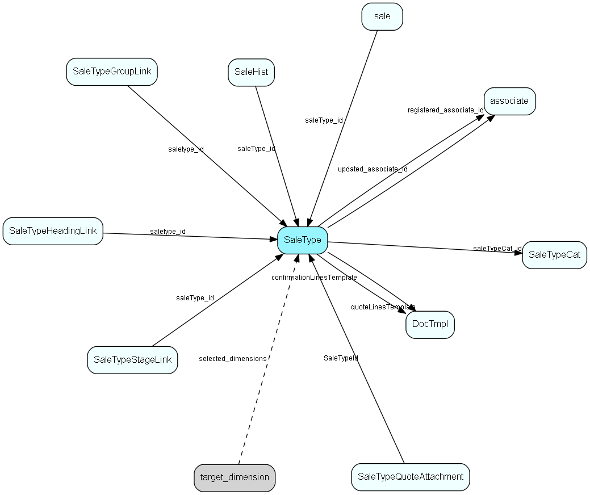

# SaleType Table (149)

SaleType MDO list item table.
Type of sale - large solution, incremental, whatever fits the organization

## Fields

| Name | Description | Type | Null |
|------|-------------|------|:----:|
|SaleType\_Id|Primary key|PK| |
|name|The list item|String(239)| |
|rank|Rank order|UShort|&#x25CF;|
|tooltip|Tooltip or other description|String(254)|&#x25CF;|
|deleted|0 -&gt; record is active 1 -&gt; record is &apos;deleted&apos; and should not be shown in lists|UShort|&#x25CF;|
|saleDuration|Expected number of dales from initiation to close of sale|Int|&#x25CF;|
|durationUnit|Units for the duration (day, week, whatever)|Enum [DurationUnit](enums/durationunit.md)|&#x25CF;|
|hasGuide|Does this sale type have a guide attached|Bool|&#x25CF;|
|isAutoAdvance|Does the sale stage advance automatically, when the last guided activity in a stage is completed?|Bool|&#x25CF;|
|saleTypeCat\_id|Category of sale type, copied to sale|FK [SaleTypeCat](saletypecat.md)|&#x25CF;|
|registered|Registered when|UtcDateTime| |
|registered\_associate\_id|Registered by whom|FK [associate](associate.md)| |
|updated|Last updated when|UtcDateTime| |
|updated\_associate\_id|Last updated by whom|FK [associate](associate.md)| |
|updatedCount|Number of updates made to this record|UShort| |
|hasStakeholders|Does this sale type have stakeholders|UShort|&#x25CF;|
|allowQuoteAlternatives|Can quotes linked to sales of this type, have multiple Alternatives|Bool|&#x25CF;|
|defaultQuoteValidity|Default valid days for quotes linked to sales of this type (valid from quote transmission)|Int|&#x25CF;|
|quoteLinesTemplate|The template that this sale type should use when producing the product lines offer document; the template must have DocTmplQuoteType=QuoteLines|FK [DocTmpl](doctmpl.md)|&#x25CF;|
|maxDiscountPercentSet|Is there a limit, in percent, to the total discount on quotes linked to sales of this type|Bool|&#x25CF;|
|minEarningPercentSet|Is there a limit, in earning as percent of total, on quotes linked to sales of this type|Bool|&#x25CF;|
|maxDiscountPercent|The maximum discount in percent of total, if set, on quotes linked to sales of this type|Int|&#x25CF;|
|minEarningPercent|The minimum earning in percent of total, if set, on quotes linked to sales of this type|Int|&#x25CF;|
|confirmationLinesTemplate|The template that this sale type should use when producing the order confirmation lines document; the template must have DocTmplQuoteType=ConfirmationLines|FK [DocTmpl](doctmpl.md)|&#x25CF;|
|documentGroupingFields|Comma-separated names of grouping fields for quote lines, when generating the documents|String(59)|&#x25CF;|
|archiveGroupingFields|Comma-separated names of grouping fields for quote lines, in the quote lines archive|String(59)|&#x25CF;|

[!include[details](./includes/saletype.md)]

## Indexes

| Fields | Types | Description |
|--------|-------|-------------|
|SaleType\_Id |PK |Clustered, Unique |
|name |String(239) |Unique |

## Relationships

| Table|  Description |
|------|-------------|
|[associate](associate.md)  |Employees, resources and other users - except for External persons |
|[DocTmpl](doctmpl.md)  |DocTmpl list table. Describes templates available for writing new documents. |
|[sale](sale.md)  |Sales  For every Sale record edited through the SuperOffice GUI, a copy of the current version of the record will be saved in the SaleHist table. This also applies to editing done through the SaleModel COM interface, but not to editing done through the OLE DB Provider or other channels.   |
|[SaleHist](salehist.md)  |Mirror image of the Sale table, providing a full transaction history. Every time you edit a sale, the current record of the sale is also saved here.  |
|[SaleTypeCat](saletypecat.md)  |Category for sale type |
|[SaleTypeGroupLink](saletypegrouplink.md)  |User group link table for SaleType, for MDO item hiding |
|[SaleTypeHeadingLink](saletypeheadinglink.md)  |Heading link table for SaleType, for MDO headers |
|[SaleTypeQuoteAttachment](saletypequoteattachment.md)  |Default attachments to quotes linked to sales of this type |
|[SaleTypeStageLink](saletypestagelink.md)  |Many-many link table between sale type and stage; and an anchor point for guide items |
|[target\_dimension](target-dimension.md)  |Defining target dimension |

## Replication Flags

* Replicate changes DOWN from central to satellites and travellers.
* Replicate changes UP from satellites and travellers back to central.
* Copy to satellite and travel prototypes.

## Security Flags

* No access control via user's Role.

