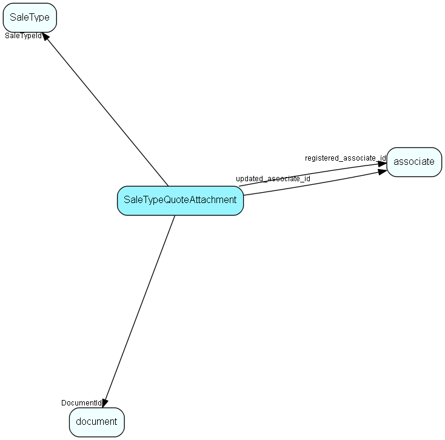

# SaleTypeQuoteAttachment Table (446)

Default attachments to quotes linked to sales of this type

## Fields

| Name | Description | Type | Null |
|------|-------------|------|:----:|
|saletypequoteattachment\_id|Primary key|PK| |
|SaleTypeId|Link to sale type|FK [SaleType](saletype.md)| |
|DocumentId|Link to document|FK [document](document.md)| |
|DefaultIncluded|Should this be a standard attachment (default state is &apos;include&apos;)|Bool|&#x25CF;|
|registered|Registered when|UtcDateTime| |
|registered\_associate\_id|Registered by whom|FK [associate](associate.md)| |
|updated|Last updated when|UtcDateTime| |
|updated\_associate\_id|Last updated by whom|FK [associate](associate.md)| |
|updatedCount|Number of updates made to this record|UShort| |

[!include[details](./includes/saletypequoteattachment.md)]

## Indexes

| Fields | Types | Description |
|--------|-------|-------------|
|saletypequoteattachment\_id |PK |Clustered, Unique |

## Relationships

| Table|  Description |
|------|-------------|
|[associate](associate.md)  |Employees, resources and other users - except for External persons |
|[document](document.md)  |Documents, this table is an extension of the Appointment table.  There is always a corresponding appointment record; the relation between appointment and document is navigable in both directions. A document-type appointment record always has a corresponding document record and a record in VisibleFor specifying who may see this.   |
|[SaleType](saletype.md)  |Type of sale - large solution, incremental, whatever fits the organization |

## Replication Flags

* None

## Security Flags

* No access control via user's Role.

