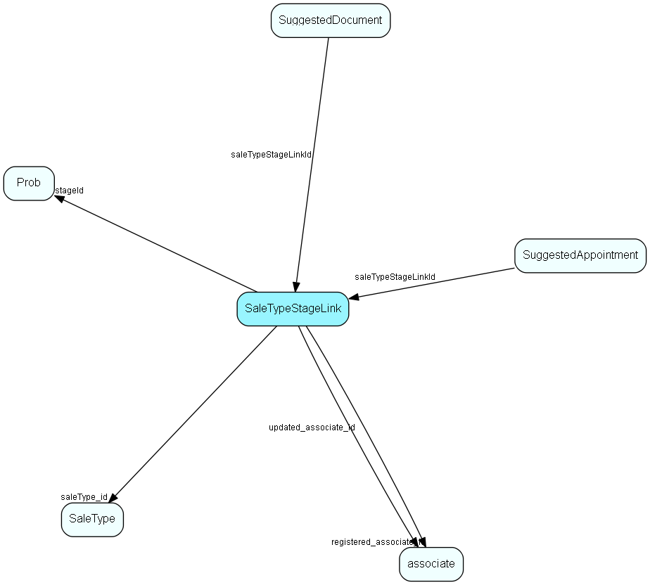

# SaleTypeStageLink Table (160)

Many-many link table between sale type and stage; and an anchor point for guide items

## Fields

| Name | Description | Type | Null |
|------|-------------|------|:----:|
|SaleTypeStageLink\_id|Primary key|PK| |
|saleType\_id|Link to sale type|FK [SaleType](saletype.md)| |
|stageId|Link to prob, aka Stage|FK [Prob](prob.md)| |
|rank|Rank order |UShort|&#x25CF;|
|deleted|0 -&gt; record is active 1 -&gt; record is &apos;deleted&apos; and should not be shown in lists|UShort|&#x25CF;|
|registered|Registered when|UtcDateTime| |
|registered\_associate\_id|Registered by whom|FK [associate](associate.md)| |
|updated|Last updated when|UtcDateTime| |
|updated\_associate\_id|Last updated by whom|FK [associate](associate.md)| |
|updatedCount|Number of updates made to this record|UShort| |

[!include[details](./includes/saletypestagelink.md)]

## Indexes

| Fields | Types | Description |
|--------|-------|-------------|
|SaleTypeStageLink\_id |PK |Clustered, Unique |
|saleType\_id, stageId |FK, FK |Index |

## Relationships

| Table|  Description |
|------|-------------|
|[associate](associate.md)  |Employees, resources and other users - except for External persons |
|[Prob](prob.md)  |Prob list table. Probability, used in  sales . |
|[SaleType](saletype.md)  |Type of sale - large solution, incremental, whatever fits the organization |
|[SuggestedAppointment](suggestedappointment.md)  |Defines a suggested appointment for use in a Sale Guide or Project Guide |
|[SuggestedDocument](suggesteddocument.md)  |Unique owner of a set of licensed modules |

## Replication Flags

* Replicate changes DOWN from central to satellites and travellers.
* Replicate changes UP from satellites and travellers back to central.
* Copy to satellite and travel prototypes.

## Security Flags

* No access control via user's Role.

