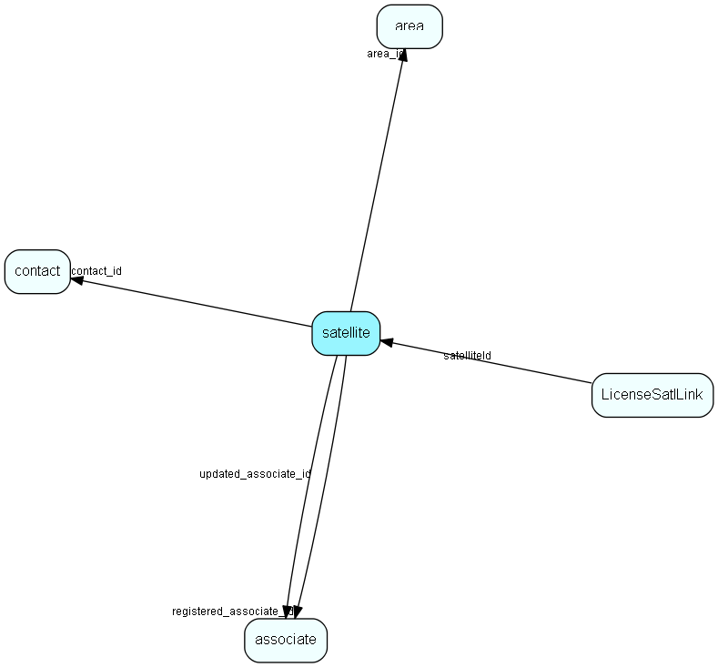

# satellite Table (42)

Definition of Satellites

## Fields

| Name | Description | Type | Null |
|------|-------------|------|:----:|
|satellite\_id|Primary key|PK| |
|area\_id|Area this satellite is based on (mandatory != 0)|FK [area](area.md)| |
|contact\_id|Contact card that owns this satellite|FK [contact](contact.md)| |
|encryptedComm|Use encryption for this Satellite?|UShort|&#x25CF;|
|DSN|Data source name last used for this satellite|String(254)| |
|registered|Registered when|UtcDateTime| |
|registered\_associate\_id|Registered by whom|FK [associate](associate.md)| |
|updated|Last updated when|UtcDateTime| |
|updated\_associate\_id|Last updated by whom|FK [associate](associate.md)| |
|updatedCount|Number of updates made to this record|UShort| |

[!include[details](./includes/satellite.md)]

## Indexes

| Fields | Types | Description |
|--------|-------|-------------|
|satellite\_id |PK |Clustered, Unique |

## Relationships

| Table|  Description |
|------|-------------|
|[area](area.md)  |Definition of an Area (database subset for satellite and travel) |
|[associate](associate.md)  |Employees, resources and other users - except for External persons |
|[contact](contact.md)  |Companies and Organizations.   This table features a special record containing information about the contact that owns the database.   |
|[LicenseSatlLink](licensesatllink.md)  |Link between License and Satellite, for per-database licenses |

## Replication Flags

* Replicate changes DOWN from central to satellites and travellers.
* Copy to satellite and travel prototypes.

## Security Flags

* Sentry controls access to items in this table using user's Role and data rights matrix.

