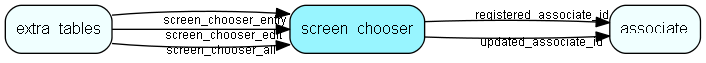

# screen\_chooser Table (375)

Screen choosers

## Fields

| Name | Description | Type | Null |
|------|-------------|------|:----:|
|id|Primary key|PK| |
|screen\_type|Event id that triggers script.  See EventHandlerType enum.|screen_type|&#x25CF;|
|screen\_target|What screen this is a chooser for|Int| |
|ejscript|The CRMscript code for this event handler|Clob|&#x25CF;|
|description|Optional description of what this script is used for.|String(2047)|&#x25CF;|
|enabled|Whether this screen chooser is enabled or not|Bool|&#x25CF;|
|unique\_identifier|Global unique identifier, accross customers/tenants|String(64)| |
|registered|Registered when|UtcDateTime|&#x25CF;|
|registered\_associate\_id|Registered by whom|FK [associate](associate.md)|&#x25CF;|
|updated|Last updated when|UtcDateTime|&#x25CF;|
|updated\_associate\_id|Last updated by whom|FK [associate](associate.md)|&#x25CF;|
|updatedCount|Number of updates made to this record|UShort| |
|ejscript\_id|The ejscript row containing the TypeScript for this trigger|FK [ejscript](ejscript.md)|&#x25CF;|

[!include[details](./includes/screen-chooser.md)]

## Indexes

| Fields | Types | Description |
|--------|-------|-------------|
|id |PK |Clustered, Unique |
|screen\_target |Int |Index |
|unique\_identifier |String(64) |Unique |

## Relationships

| Table|  Description |
|------|-------------|
|[associate](associate.md)  |Employees, resources and other users - except for External persons |
|[ejscript](ejscript.md)  |ejscript |
|[extra\_tables](extra-tables.md)  |This table contains entries for the extra tables in the system. |

## Replication Flags

* None

## Security Flags

* No access control via user's Role.

