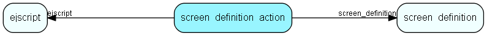

# screen\_definition\_action Table (371)

An action to perform for a certain button in an screen

## Fields

| Name | Description | Type | Null |
|------|-------------|------|:----:|
|id|Primary key|PK| |
|screen\_definition|The screen-definition this element belongs to|FK [screen_definition](screen-definition.md)|&#x25CF;|
|button|The name of the button triggering this action|String(255)|&#x25CF;|
|ejscript|Deprecated. The ejscript to execute if this is a form which is posted|FK [ejscript](ejscript.md)|&#x25CF;|
|ejscript\_body|The script to execute for this button/action|Clob|&#x25CF;|
|do\_check|If set, then run check() before executing button (making sure values in form fields are ok)|Bool|&#x25CF;|

[!include[details](./includes/screen-definition-action.md)]

## Indexes

| Fields | Types | Description |
|--------|-------|-------------|
|id |PK |Clustered, Unique |
|screen\_definition |FK |Index |
|ejscript |FK |Index |

## Relationships

| Table|  Description |
|------|-------------|
|[ejscript](ejscript.md)  |ejscript |
|[screen\_definition](screen-definition.md)  |A configurable screen |

## Replication Flags

* None

## Security Flags

* No access control via user's Role.

