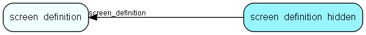

# screen\_definition\_hidden Table (373)

The name of a hidden variable to keep for this screen

## Fields

| Name | Description | Type | Null |
|------|-------------|------|:----:|
|id|Primary key|PK| |
|screen\_definition|The screen-definition this element belongs to|FK [screen_definition](screen-definition.md)|&#x25CF;|
|variable|The name of the variable to keep|String(255)|&#x25CF;|

[!include[details](./includes/screen-definition-hidden.md)]

## Indexes

| Fields | Types | Description |
|--------|-------|-------------|
|id |PK |Clustered, Unique |
|screen\_definition |FK |Index |

## Relationships

| Table|  Description |
|------|-------------|
|[screen\_definition](screen-definition.md)  |A configurable screen |

## Replication Flags

* None

## Security Flags

* No access control via user's Role.

