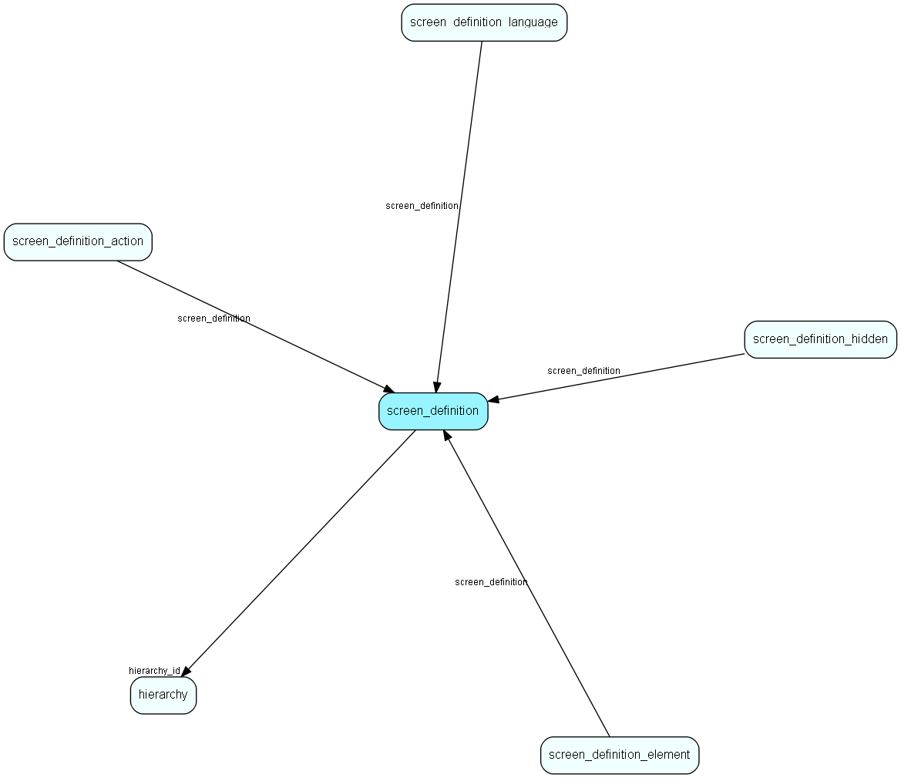

# screen\_definition Table (370)

A configurable screen

## Fields

| Name | Description | Type | Null |
|------|-------------|------|:----:|
|id|Primary key|PK| |
|name|A field for entering the name of this entry|String(255)| |
|id\_string|A field for an id_string which may be used to access the screen|String(255)| |
|hierarchy\_id|The screen definition is inside this hierarchy folder|FK [hierarchy](hierarchy.md)| |
|screen\_key|This field holds the authentication key if used|String(255)| |
|layout\_model|An enum for which layout model this screen is using.|layout_model|&#x25CF;|
|load\_script\_body|The ejscript to execute the first time this screen is loaded, e.g. for form loading|Clob|&#x25CF;|
|load\_post\_cgi\_script\_body|The ejscript to execute after setFromCgi, e.g. when the page is submitted|Clob|&#x25CF;|
|load\_final\_script\_body|The ejscript to execute just before the page is printed, after button/action scripts have been run|Clob|&#x25CF;|
|creation\_script|The script used at the top of all other creation scripts on this page|Clob|&#x25CF;|
|warn\_on\_navigate|Decides if user will get a warning if he accidentally navigates away from unsaved changes for this screen|Bool| |
|description|Optional description of what this screen is used for|String(2047)|&#x25CF;|
|autosave|Whether this screen uses autosave or not|Bool|&#x25CF;|

[!include[details](./includes/screen-definition.md)]

## Indexes

| Fields | Types | Description |
|--------|-------|-------------|
|id |PK |Clustered, Unique |
|hierarchy\_id |FK |Index |

## Relationships

| Table|  Description |
|------|-------------|
|[hierarchy](hierarchy.md)  |This table contains folders used to group the extra tables in the system. |
|[screen\_definition\_action](screen-definition-action.md)  |An action to perform for a certain button in an screen |
|[screen\_definition\_element](screen-definition-element.md)  |An element in a configurable screen |
|[screen\_definition\_hidden](screen-definition-hidden.md)  |The name of a hidden variable to keep for this screen |
|[screen\_definition\_language](screen-definition-language.md)  |Custom language variables used for screens |

## Replication Flags

* None

## Security Flags

* No access control via user's Role.

