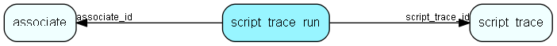

# script\_trace\_run Table (475)

Traces of executed scripts

## Fields

| Name | Description | Type | Null |
|------|-------------|------|:----:|
|script\_trace\_run\_id|Primary key|PK| |
|script\_trace\_id|Id of parent script_trace record|FK [script_trace](script-trace.md)|&#x25CF;|
|started\_at|When the trace was started|DateTime|&#x25CF;|
|ended\_at|When the trace was ended|DateTime|&#x25CF;|
|execution\_time|Real seconds spent executing|Int|&#x25CF;|
|user\_execution\_time|CPU seconds spent executing|Int|&#x25CF;|
|peak\_memory|The maximum amount of used memory during execution (in kB)|Int|&#x25CF;|
|num\_frames|The number of frames saved|Int|&#x25CF;|
|file\_size|The size of the trace file|Int|&#x25CF;|
|associate\_id|Associate who the script was executed as|FK [associate](associate.md)|&#x25CF;|
|status|The status of the script, or exception if it fails|String(2047)|&#x25CF;|
|frames|The frames of the the trace|Clob|&#x25CF;|

[!include[details](./includes/script-trace-run.md)]

## Indexes

| Fields | Types | Description |
|--------|-------|-------------|
|script\_trace\_run\_id |PK |Clustered, Unique |

## Relationships

| Table|  Description |
|------|-------------|
|[associate](associate.md)  |Employees, resources and other users - except for External persons |
|[script\_trace](script-trace.md)  |Scripts which should be traced |

## Replication Flags

* None

## Security Flags

* No access control via user's Role.

