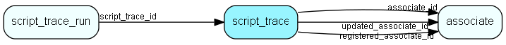

# script\_trace Table (474)

Scripts which should be traced

## Fields

| Name | Description | Type | Null |
|------|-------------|------|:----:|
|script\_trace\_id|Primary key|PK| |
|name|The friendly name of the script which should be traced|String(255)|&#x25CF;|
|location|The location of the script which should be traced|String(255)|&#x25CF;|
|skip\_frames|Skip n frames between each save to optimize|Int|&#x25CF;|
|enabled|Whether this trace is enabled or not|Bool|&#x25CF;|
|ttl|How long traces should be kept before being deleted (in seconds)|Int|&#x25CF;|
|associate\_id|Optionally limit traces to a specific associate|FK [associate](associate.md)|&#x25CF;|
|registered|Registered when|UtcDateTime| |
|registered\_associate\_id|Registered by whom|FK [associate](associate.md)| |
|updated|Last updated when|UtcDateTime| |
|updated\_associate\_id|Last updated by whom|FK [associate](associate.md)| |
|updatedCount|Number of updates made to this record|UShort| |
|notification\_email|Email to notify when trace saved|String(255)|&#x25CF;|
|notify|Send notification by email when trace run is saved|Bool|&#x25CF;|
|num\_notifications|How many (more) notifications left before it is disabled|Int|&#x25CF;|
|exception\_only|If true, then we save the trace run only if an unhandled exception is thrown|Bool|&#x25CF;|
|sum\_runs|How many trace runs have been saved|Int|&#x25CF;|
|sum\_size|How much trace data has been saved|Int|&#x25CF;|

[!include[details](./includes/script-trace.md)]

## Indexes

| Fields | Types | Description |
|--------|-------|-------------|
|script\_trace\_id |PK |Clustered, Unique |

## Relationships

| Table|  Description |
|------|-------------|
|[associate](associate.md)  |Employees, resources and other users - except for External persons |
|[script\_trace\_run](script-trace-run.md)  |Traces of executed scripts |

## Replication Flags

* None

## Security Flags

* No access control via user's Role.

