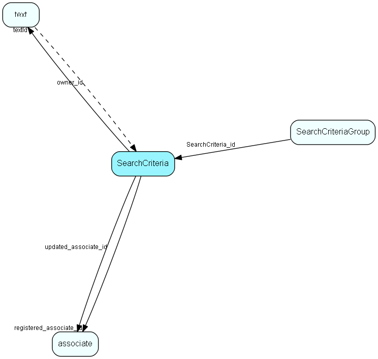

# SearchCriteria Table (201)

Criteria storage for Selection and other Find mechanisms

## Fields

| Name | Description | Type | Null |
|------|-------------|------|:----:|
|SearchCriteria\_id|Primary key|PK| |
|name|Name of this criteria collection|String(254)| |
|textId|Extra information (descriptive) for this Criteria set|FK [text](text.md)|&#x25CF;|
|ownerType|Selection, Reporter, FindProject, ...|Enum [OwnerType](enums/ownertype.md)|&#x25CF;|
|ownerTable|Table number of table that owns these criteria|TableNumber|&#x25CF;|
|ownerId|Record ID in ownerTable that owns these criteria|RecordId|&#x25CF;|
|registered|Registered when|UtcDateTime| |
|registered\_associate\_id|Registered by whom|FK [associate](associate.md)| |
|updated|Last updated when|UtcDateTime| |
|updated\_associate\_id|Last updated by whom|FK [associate](associate.md)| |
|updatedCount|Number of updates made to this record|UShort| |
|ownerName|Name of owner; this is the archive provider name in NetServer/SIX.web|String(254)|&#x25CF;|
|ownerGuiName|Name of the owner GUI control, this is the GUI XML id in SIX.web|String(254)|&#x25CF;|
|displayName|Display name when these criteria are a saved archive filter|String(254)|&#x25CF;|

[!include[details](./includes/searchcriteria.md)]

## Indexes

| Fields | Types | Description |
|--------|-------|-------------|
|SearchCriteria\_id |PK |Clustered, Unique |
|ownerId, ownerName, ownerGuiName |RecordId, String(254), String(254) |Index |
|ownerId, ownerTable, ownerType, ownerGuiName |RecordId, TableNumber, Enum, String(254) |Index |

## Relationships

| Table|  Description |
|------|-------------|
|[associate](associate.md)  |Employees, resources and other users - except for External persons |
|[SearchCriteriaGroup](searchcriteriagroup.md)  |Criteria storage for Selection and other Find mechanisms |
|[text](text.md)  |Long text fields from all over the system |

## Replication Flags

* Area Management controlled table. Contents replicated to satellites and traveller databases.
* Replicate changes UP from satellites and travellers back to central.
* Copy to satellite and travel prototypes.

## Security Flags

* No access control via user's Role.

