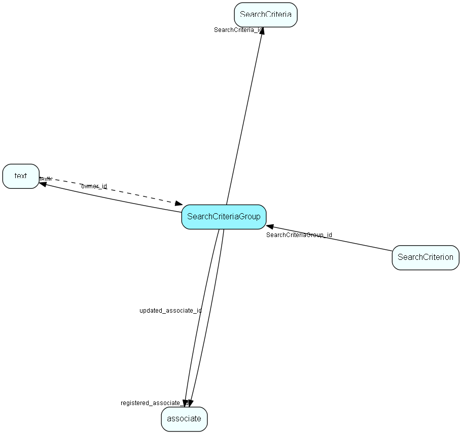

# SearchCriteriaGroup Table (202)

Criteria storage for Selection and other Find mechanisms

## Fields

| Name | Description | Type | Null |
|------|-------------|------|:----:|
|SearchCriteriaGroup\_id|Primary key|PK| |
|SearchCriteria\_id|Owning model|FK [SearchCriteria](searchcriteria.md)| |
|name|The name of this criteria group|String(254)| |
|textId|Extra information (descriptive) for this Criteria Group|FK [text](text.md)|&#x25CF;|
|direction|0 = Add, 1 = Subtract this group from the total result|Enum [CriteriaGroupDirection](enums/criteriagroupdirection.md)| |
|rank|Rank order within this CriteriaModel|UShort| |
|active|Should this group be executed|UShort| |
|registered|Registered when|UtcDateTime| |
|registered\_associate\_id|Registered by whom|FK [associate](associate.md)| |
|updated|Last updated when|UtcDateTime| |
|updated\_associate\_id|Last updated by whom|FK [associate](associate.md)| |
|updatedCount|Number of updates made to this record|UShort| |

[!include[details](./includes/searchcriteriagroup.md)]

## Indexes

| Fields | Types | Description |
|--------|-------|-------------|
|SearchCriteriaGroup\_id |PK |Clustered, Unique |

## Relationships

| Table|  Description |
|------|-------------|
|[associate](associate.md)  |Employees, resources and other users - except for External persons |
|[SearchCriteria](searchcriteria.md)  |Criteria storage for Selection and other Find mechanisms |
|[SearchCriterion](searchcriterion.md)  |Criteria storage for Selection and other Find mechanisms |
|[text](text.md)  |Long text fields from all over the system |

## Replication Flags

* Area Management controlled table. Contents replicated to satellites and traveller databases.
* Replicate changes UP from satellites and travellers back to central.
* Copy to satellite and travel prototypes.

## Security Flags

* No access control via user's Role.

