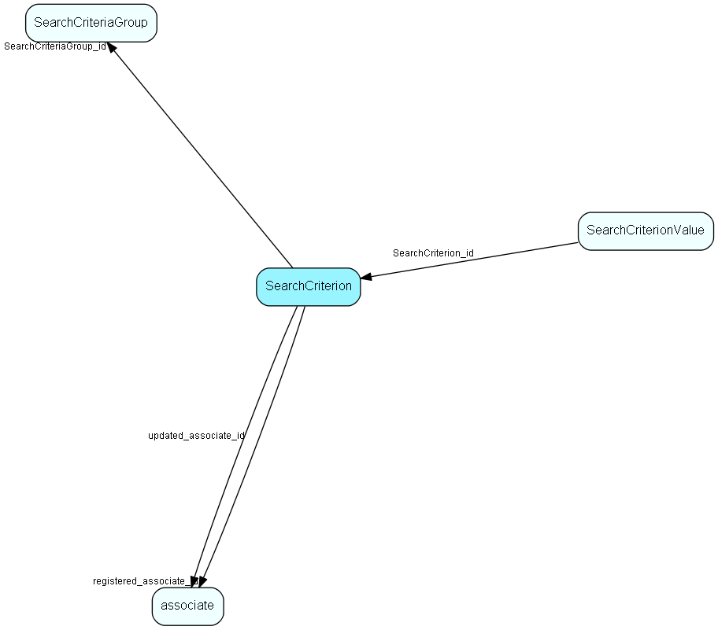

# SearchCriterion Table (203)

Criteria storage for Selection and other Find mechanisms

## Fields

| Name | Description | Type | Null |
|------|-------------|------|:----:|
|SearchCriterion\_id|Primary key|PK| |
|SearchCriteriaGroup\_id|Owning group|FK [SearchCriteriaGroup](searchcriteriagroup.md)| |
|criterionId|Usually DbFieldId of field to be searched|FieldId| |
|extraId|Extra info, forms part of the internal unique identification of the criterion|Id|&#x25CF;|
|udefIdentity|Extra info for searching udef fields, to keep track of actual field across layout changes|Id|&#x25CF;|
|operatorId|Operator ID|Enum [CriterionOperator](enums/criterionoperator.md)| |
|linkType|Link type, AND or OR|Enum [CriterionLinkType](enums/criterionlinktype.md)| |
|active|Should this criterion be executed|UShort| |
|rank|Ordering within this group|UShort| |
|registered|Registered when|UtcDateTime| |
|registered\_associate\_id|Registered by whom|FK [associate](associate.md)| |
|updated|Last updated when|UtcDateTime| |
|updated\_associate\_id|Last updated by whom|FK [associate](associate.md)| |
|updatedCount|Number of updates made to this record|UShort| |
|columnName|Column name from archive provider in NetServer/SIX.web|String(254)|&#x25CF;|
|operatorName|Operator name from archive provider|String(254)|&#x25CF;|
|uniqueKey|Unique key (hash) from ArchiveRestrictionInfo|Id|&#x25CF;|
|parenthesis|Parenthesis value, positive is number of opening parentheses to prepend to this criterion, negative is the number of closing parentheses to append|Short|&#x25CF;|

[!include[details](./includes/searchcriterion.md)]

## Indexes

| Fields | Types | Description |
|--------|-------|-------------|
|SearchCriterion\_id |PK |Clustered, Unique |

## Relationships

| Table|  Description |
|------|-------------|
|[associate](associate.md)  |Employees, resources and other users - except for External persons |
|[SearchCriteriaGroup](searchcriteriagroup.md)  |Criteria storage for Selection and other Find mechanisms |
|[SearchCriterionValue](searchcriterionvalue.md)  |Criteria storage for Selection and other Find mechanisms |

## Replication Flags

* Area Management controlled table. Contents replicated to satellites and traveller databases.
* Replicate changes UP from satellites and travellers back to central.
* Copy to satellite and travel prototypes.

## Security Flags

* No access control via user's Role.

