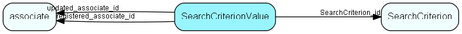

# SearchCriterionValue Table (204)

Criteria storage for Selection and other Find mechanisms

## Fields

| Name | Description | Type | Null |
|------|-------------|------|:----:|
|SearchCriterionValue\_id|Primary key|PK| |
|SearchCriterion\_id|Owning group|FK [SearchCriterion](searchcriterion.md)| |
|longValue|Value for long type|Int|&#x25CF;|
|doubleValue|Value for double type|Double|&#x25CF;|
|stringValue|Value for String type|String(254)|&#x25CF;|
|rank|Ordering within this group|UShort| |
|listTableId|List table ID, 0 if this is not a reference to a list|TableNumber|&#x25CF;|
|listItemId|List item ID: the primary key of the list table identified above, or 0.|RecordId|&#x25CF;|
|registered|Registered when|UtcDateTime| |
|registered\_associate\_id|Registered by whom|FK [associate](associate.md)| |
|updated|Last updated when|UtcDateTime| |
|updated\_associate\_id|Last updated by whom|FK [associate](associate.md)| |
|updatedCount|Number of updates made to this record|UShort| |
|valueType|The RestrictionType that describes this value; might vary between values connected to the same criterion|String(128)|&#x25CF;|

[!include[details](./includes/searchcriterionvalue.md)]

## Indexes

| Fields | Types | Description |
|--------|-------|-------------|
|SearchCriterionValue\_id |PK |Clustered, Unique |

## Relationships

| Table|  Description |
|------|-------------|
|[associate](associate.md)  |Employees, resources and other users - except for External persons |
|[SearchCriterion](searchcriterion.md)  |Criteria storage for Selection and other Find mechanisms |

## Replication Flags

* Area Management controlled table. Contents replicated to satellites and traveller databases.
* Replicate changes UP from satellites and travellers back to central.
* Copy to satellite and travel prototypes.

## Security Flags

* No access control via user's Role.

