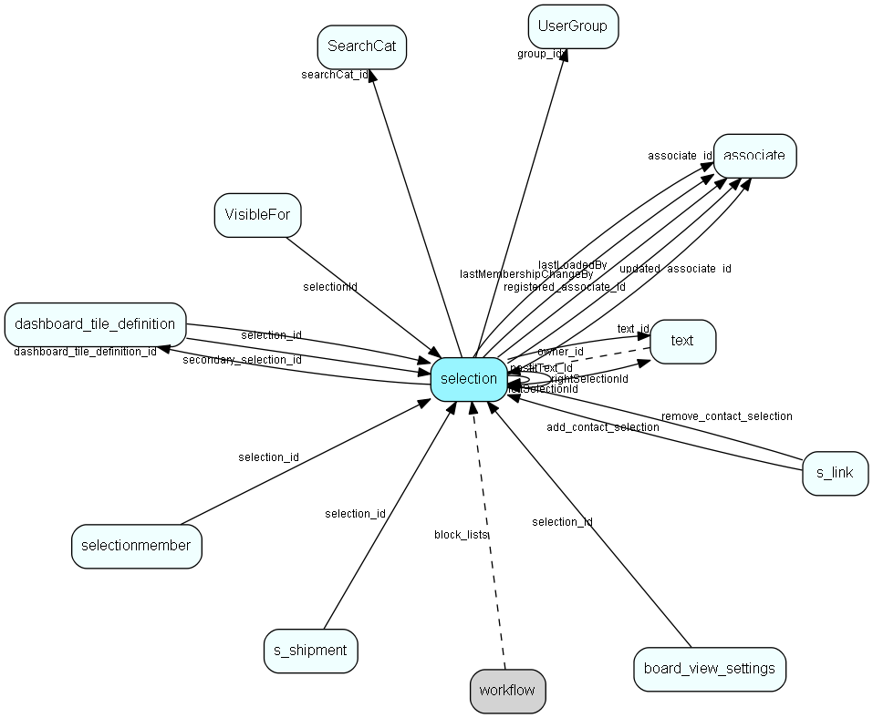

# selection Table (23)

Selections

## Fields

| Name | Description | Type | Null |
|------|-------------|------|:----:|
|selection\_id|Primary key|PK| |
|associate\_id|Associate who owns the selection|FK [associate](associate.md)| |
|group\_idx|Original primary user group of associate|FK [UserGroup](usergroup.md)| |
|name|Name, freetext indexed|String(219)| |
|text\_id|Description text|FK [text](text.md)|&#x25CF;|
|postitText\_Id|Postit text|FK [text](text.md)|&#x25CF;|
|visibility|Obsolete, but still maintained denormalization of visiblefor|UShort|&#x25CF;|
|seltype|0 = static selection, 1 = dynamic selection, 2 = combined selection. See the &apos;SystemType&apos; field to disnguish between user selections, and Temporary or other system-managed kinds of selection|UShort|&#x25CF;|
|searchCat\_id|Search category (list)|FK [SearchCat](searchcat.md)|&#x25CF;|
|companyUnique|Only one person from a company may be selected as a member|UShort|&#x25CF;|
|soundEx|What the name sounds like, for duplicate detection|String(9)|&#x25CF;|
|source|How did we get this selection? For future integration needs|UShort|&#x25CF;|
|memberCount|How many selectionmembers (for progress bar)|UInt|&#x25CF;|
|registered|Registered when|UtcDateTime| |
|registered\_associate\_id|Registered by whom|FK [associate](associate.md)| |
|updated|Last updated when|UtcDateTime| |
|updated\_associate\_id|Last updated by whom|FK [associate](associate.md)| |
|updatedCount|Number of updates made to this record|UShort| |
|includePerson|0 = Include first person, 1 = Include all persons, 2 = Include no persons|Int|&#x25CF;|
|targetTableNumber|Table number that this is a selection of (contact, sale, appointment, ....)|TableNumber| |
|done|Done (0=false, 1=true). Status implies changes in which fields are shown in GUI, as well as which fields can be updated|Bool|&#x25CF;|
|combinationType|How should the inputs of a combined selection be combined|Enum [SelectionUnionType](enums/selectionuniontype.md)|&#x25CF;|
|leftSelectionId|ID of the left selection of a combined selection|FK [selection](selection.md)|&#x25CF;|
|rightSelectionId|ID of the right selection of a combined selection|FK [selection](selection.md)|&#x25CF;|
|dashboard\_tile\_definition\_id|The associated tile definition|FK [dashboard_tile_definition](dashboard-tile-definition.md)|&#x25CF;|
|SystemType|Selection system type - defines if this selection is one that is managed by the system, and what kind it is|Enum [SelectionSystemType](enums/selectionsystemtype.md)|&#x25CF;|
|chartKey|ID/key of the last-used chart tile on this selection|String(254)|&#x25CF;|
|lastLoaded|The date/time this selection was last loaded (selectionentity fetched)|DateTime|&#x25CF;|
|lastLoadedBy|Who last loaded this selection|FK [associate](associate.md)|&#x25CF;|
|lastMembershipChange|The date/time the membership the selection last changed. Dynamic: change of criteria; Static: add/remove members; Combined: change of algorithm|DateTime|&#x25CF;|
|lastMembershipChangeBy|Who last changed the membership|FK [associate](associate.md)|&#x25CF;|

[!include[details](./includes/selection.md)]

## Indexes

| Fields | Types | Description |
|--------|-------|-------------|
|selection\_id |PK |Unique |
|group\_idx |FK |Index |
|name |String(219) |Index |
|soundEx |String(9) |Index |
|source |UShort |Index |
|done |Bool |Index |
|associate\_id |FK |Clustered |

## Relationships

| Table|  Description |
|------|-------------|
|[associate](associate.md)  |Employees, resources and other users - except for External persons |
|[dashboard\_tile\_definition](dashboard-tile-definition.md)  |Describes the contents of a tile |
|[s\_link](s-link.md)  |Links in messages to measure success rate of a campaign. |
|[s\_shipment](s-shipment.md)  |Contains info about one shipment. The addresses are stored in s_shipment_addr |
|[SearchCat](searchcat.md)  |SearchCat list table |
|[selection](selection.md)  |Selections |
|[selectionmember](selectionmember.md)  |Selection detail table  Each row in a selection is represented by one record in this table. Contact_id is always filled in, person_id is optional, but if used, must point to a person belonging to the contact in contact_id. |
|[text](text.md)  |Long text fields from all over the system |
|[UserGroup](usergroup.md)  |Secondary user groups |
|[VisibleFor](visiblefor.md)  |Visible for rights, who may see this appointment/document, sale,  salehist or selection |
|[workflow](workflow.md)  |SuperOffice specific info about a workflow |

## Replication Flags

* None

## Security Flags

* Sentry controls access to items in this table using user's Role and data rights matrix.
* Visibility controlled via matching [VisibleFor](VisibleFor.md) row.

