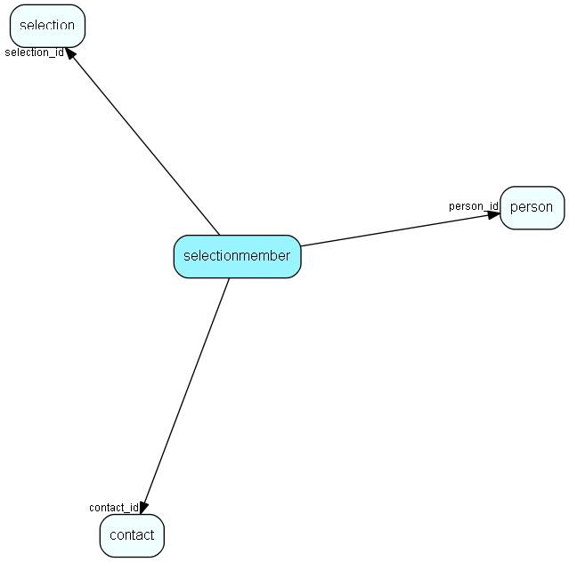

# selectionmember Table (24)

Selection detail table  Each row in a selection is represented by one record in this table. Contact_id is always filled in, person_id is optional, but if used, must point to a person belonging to the contact in contact_id.

## Fields

| Name | Description | Type | Null |
|------|-------------|------|:----:|
|selectionmember\_id|Primary key|PK| |
|selection\_id|Owning selection|FK [selection](selection.md)| |
|contact\_id|Contact ID of selection member|FK [contact](contact.md)| |
|person\_id|Person ID of selection member, if person|FK [person](person.md)|&#x25CF;|
|targetTableNumber|Table number of the target that this selection member points to|TableNumber|&#x25CF;|
|targetRecordId|Record id of the target that this selection member points to|RecordId|&#x25CF;|

[!include[details](./includes/selectionmember.md)]

## Indexes

| Fields | Types | Description |
|--------|-------|-------------|
|selectionmember\_id |PK |Unique |
|selection\_id |FK |Index |
|person\_id |FK |Index |
|contact\_id, person\_id |FK, FK |Index |
|selection\_id, contact\_id |FK, FK |Index |
|contact\_id |FK |Clustered |

## Relationships

| Table|  Description |
|------|-------------|
|[contact](contact.md)  |Companies and Organizations. |
|[person](person.md)  |Persons |
|[selection](selection.md)  |Selections |

## Replication Flags

* None

## Security Flags

* Sentry controls access to items in this table using user's Role and data rights matrix on the table's parent.

