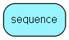

# sequence Table (0)

next_id to be used for each table

## Fields

| Name | Description | Type | Null |
|------|-------------|------|:----:|
|id|Sequence-id of host table|PK| |
|next\_id|Next id to be used for table|Id|&#x25CF;|
|TableName|The name of the table this row concerns|String(255)|&#x25CF;|
|TableNumber|The table number for this table, constant over the table&apos;s lifetime (but possibly different from one database to another|Int|&#x25CF;|

[!include[details](./includes/sequence.md)]

## Indexes

| Fields | Types | Description |
|--------|-------|-------------|
|id |PK |Clustered, Unique |
|TableName |String(255) |Unique |
|TableNumber |Int |Unique |

## Replication Flags

* None

## Security Flags

* No access control via user's Role.

