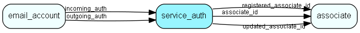

# service\_auth Table (488)

Authentication for a service (imap, smtp...)

## Fields

| Name | Description | Type | Null |
|------|-------------|------|:----:|
|service\_auth\_id|Primary key|PK| |
|server|The mail server|String(255)|&#x25CF;|
|port|The server port|Int|&#x25CF;|
|auth\_type|The type of authentication, plain-text, OAuth...|String(255)|&#x25CF;|
|username|The username|String(255)|&#x25CF;|
|password|The (encrypted) password or token|String(255)|&#x25CF;|
|registered|Registered when|UtcDateTime| |
|registered\_associate\_id|Registered by whom|FK [associate](associate.md)| |
|updated|Last updated when|UtcDateTime| |
|updated\_associate\_id|Last updated by whom|FK [associate](associate.md)| |
|updatedCount|Number of updates made to this record|UShort| |
|associate\_id|Associate who owns this authentication entry|FK [associate](associate.md)|&#x25CF;|
|auth\_status|The status of this authentication entry|Enum [ServiceAuthStatus](enums/serviceauthstatus.md)|&#x25CF;|
|encryptedCheck|Encrypted hash checksum|String(254)| |

[!include[details](./includes/service-auth.md)]

## Indexes

| Fields | Types | Description |
|--------|-------|-------------|
|service\_auth\_id |PK |Clustered, Unique |

## Relationships

| Table|  Description |
|------|-------------|
|[associate](associate.md)  |Employees, resources and other users - except for External persons |
|[email\_account](email-account.md)  |Email account information |

## Replication Flags

* None

## Security Flags

* No access control via user's Role.

