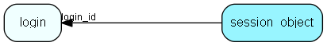

# session\_object Table (254)

Generic session object, accessible from ejscript etc, typically xml or name=value syntax, may be stored over several rows if big

## Fields

| Name | Description | Type | Null |
|------|-------------|------|:----:|
|id|The primary key (auto-incremented)|PK| |
|login\_id|The id of the login session owning this session object|FK [login](login.md)| |
|name|A unique name for the entry|String(255)| |
|part|Part number used to concatinate long values|Int| |
|value|The object value|Clob|&#x25CF;|
|created\_at|When the object was posted.|DateTime|&#x25CF;|

[!include[details](./includes/session-object.md)]

## Indexes

| Fields | Types | Description |
|--------|-------|-------------|
|id |PK |Clustered, Unique |
|login\_id |FK |Index |
|name |String(255) |Index |

## Relationships

| Table|  Description |
|------|-------------|
|[login](login.md)  |This table contains entries for the user sessions.  |

## Replication Flags

* None

## Security Flags

* No access control via user's Role.

