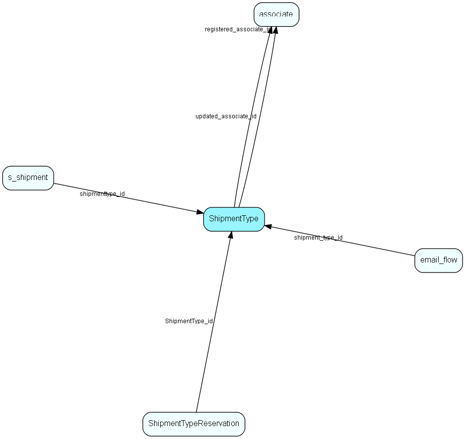

# ShipmentType Table (497)

Shipment type list table. Classification of a mailing, allowing recipients to subscribe to lists

## Fields

| Name | Description | Type | Null |
|------|-------------|------|:----:|
|ShipmentType\_id|Primary key|PK| |
|name|The list item|String(4000)| |
|tooltip|The tooltip for the list item|String(4000)|&#x25CF;|
|rank|Rank order|UShort|&#x25CF;|
|deleted|0 -&gt; record is active 1 -&gt; record is &apos;deleted&apos; and should not be shown in lists|UShort|&#x25CF;|
|registered|Registered when|UtcDateTime| |
|registered\_associate\_id|Registered by whom|FK [associate](associate.md)| |
|updated|Last updated when|UtcDateTime| |
|updated\_associate\_id|Last updated by whom|FK [associate](associate.md)| |
|updatedCount|Number of updates made to this record|UShort| |

[!include[details](./includes/shipmenttype.md)]

## Indexes

| Fields | Types | Description |
|--------|-------|-------------|
|ShipmentType\_id |PK |Clustered, Unique |

## Relationships

| Table|  Description |
|------|-------------|
|[associate](associate.md)  |Employees, resources and other users - except for External persons |
|[email\_flow](email-flow.md)  |A set of properties related to the email workflow. |
|[s\_shipment](s-shipment.md)  |Contains info about one shipment. The addresses are stored in s_shipment_addr |
|[ShipmentTypeReservation](shipmenttypereservation.md)  |ShipmentTypes a person has reserved against. Note that the absense of a record here implies acceptance of a mailings of this type |

## Replication Flags

* Replicate changes DOWN from central to satellites and travellers.
* Replicate changes UP from satellites and travellers back to central.
* Copy to satellite and travel prototypes.

## Security Flags

* No access control via user's Role.

