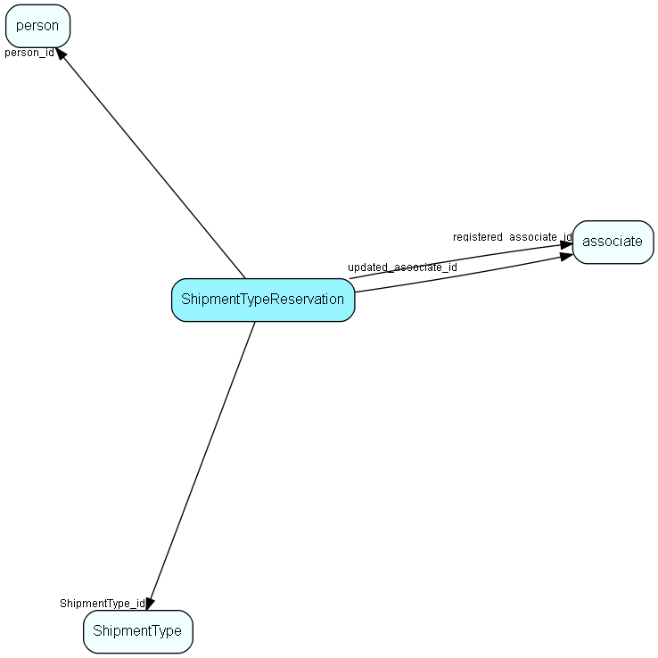

# ShipmentTypeReservation Table (498)

ShipmentTypes a person has reserved against. Note that the absense of a record here implies acceptance of a mailings of this type

## Fields

| Name | Description | Type | Null |
|------|-------------|------|:----:|
|ShipmentTypeReservation\_id|Primary key|PK| |
|person\_id|Owning person|FK [person](person.md)| |
|ShipmentType\_id|Shipment type to reserve against|FK [ShipmentType](shipmenttype.md)| |
|registered|Registered when|UtcDateTime| |
|registered\_associate\_id|Registered by whom|FK [associate](associate.md)| |
|updated|Last updated when|UtcDateTime| |
|updated\_associate\_id|Last updated by whom|FK [associate](associate.md)| |
|updatedCount|Number of updates made to this record|UShort| |

[!include[details](./includes/shipmenttypereservation.md)]

## Indexes

| Fields | Types | Description |
|--------|-------|-------------|
|ShipmentTypeReservation\_id |PK |Clustered, Unique |
|person\_id |FK |Index |
|ShipmentType\_id, person\_id |FK, FK |Index |

## Relationships

| Table|  Description |
|------|-------------|
|[associate](associate.md)  |Employees, resources and other users - except for External persons |
|[person](person.md)  |Persons in a company or an organizations. All associates have a corresponding person record |
|[ShipmentType](shipmenttype.md)  |Shipment type list table. Classification of a mailing, allowing recipients to subscribe to lists |

## Replication Flags

* Area Management controlled table. Contents replicated to satellites and traveller databases.
* Replicate changes UP from satellites and travellers back to central.
* Copy to satellite and travel prototypes.

## Security Flags

* No access control via user's Role.

