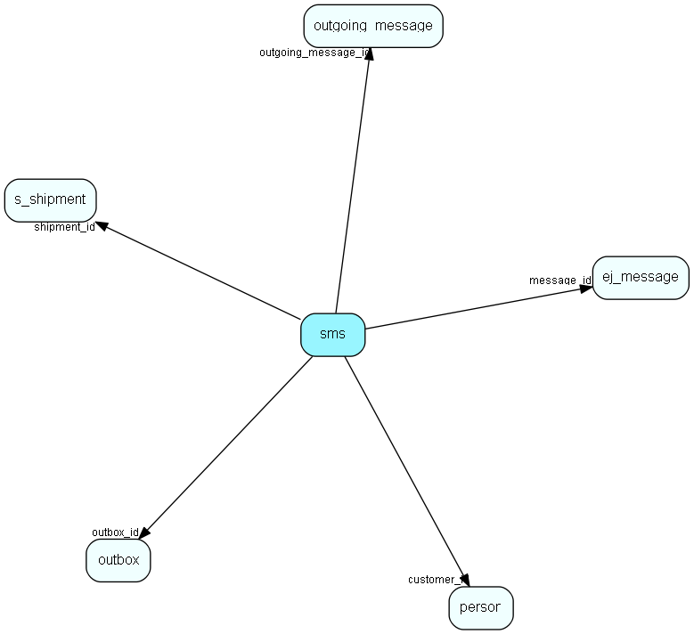

# sms Table (388)

This table will hold outgoing sms messages when transmitted with WebServices

## Fields

| Name | Description | Type | Null |
|------|-------------|------|:----:|
|id|Primary key|PK| |
|sms\_text|The actual text to be sent|Clob|&#x25CF;|
|outbox\_id|The outbox entry which holds the information about the sms to be sent|FK [outbox](outbox.md)| |
|reference\_key|The reference used for delivery report|String(255)| |
|session\_key|The reference used for identifying a session, like in-reply-to and message-id|String(255)|&#x25CF;|
|delivery\_status|Indicates a delivery status for the sms|String(255)|&#x25CF;|
|delivery\_status\_desc|Indicates a delivery status description for the sms|String(255)|&#x25CF;|
|delivery\_ext\_status|Indicates extended delivery status for the sms|String(255)|&#x25CF;|
|delivery\_ext\_status\_desc|Indicates extended delivery status description for the sms|String(255)|&#x25CF;|
|delivered\_at|The date and time when the sms was delivered|DateTime|&#x25CF;|
|shipment\_id|Reference to the shipment id, used for eMarketeer|FK [s_shipment](s-shipment.md)| |
|customer\_id|Reference to the customer id, used for eMarketeer|FK [person](person.md)| |
|message\_id|Reference to the message id this SMS was sent from|FK [ej_message](ej-message.md)| |
|outgoing\_message\_id|Reference to the outgoing message entry created by netserver for sending and status update|FK [outgoing_message](outgoing-message.md)|&#x25CF;|

[!include[details](./includes/sms.md)]

## Indexes

| Fields | Types | Description |
|--------|-------|-------------|
|id |PK |Clustered, Unique |
|outbox\_id |FK |Index |
|reference\_key |String(255) |Index |
|session\_key |String(255) |Index |
|shipment\_id |FK |Index |
|customer\_id |FK |Index |
|message\_id |FK |Index |
|outgoing\_message\_id |FK |Index |

## Relationships

| Table|  Description |
|------|-------------|
|[ej\_message](ej-message.md)  |This table contains the messages listed under tickets. |
|[outbox](outbox.md)  |Outgoing emails with sending status and other info |
|[outgoing\_message](outgoing-message.md)  |Delivery of outgoing messages to messageplugins, updated with status asynchroneously |
|[person](person.md)  |Persons in a company or an organizations. All associates have a corresponding person record |
|[s\_shipment](s-shipment.md)  |Contains info about one shipment. The addresses are stored in s_shipment_addr |

## Replication Flags

* None

## Security Flags

* No access control via user's Role.

