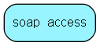

# soap\_access Table (362)

Table that contains constraints on the access to the soap interface

## Fields

| Name | Description | Type | Null |
|------|-------------|------|:----:|
|id|Primary key|PK| |
|address\_from|IP address range from address|String(255)|&#x25CF;|
|address\_to|IP address range to address|String(255)|&#x25CF;|
|type|Type: customer, ticket, admin etc|Int|&#x25CF;|

[!include[details](./includes/soap-access.md)]

## Indexes

| Fields | Types | Description |
|--------|-------|-------------|
|id |PK |Clustered, Unique |

## Replication Flags

* None

## Security Flags

* No access control via user's Role.

