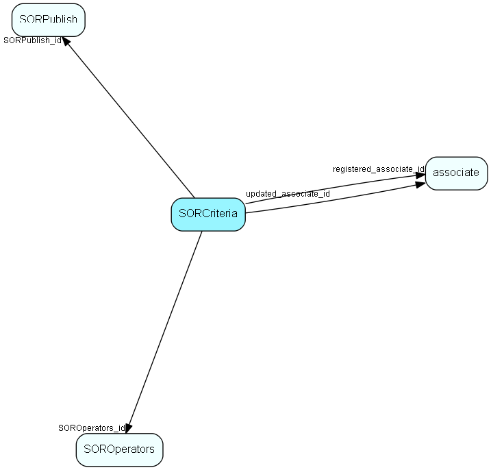

# SORCriteria Table (175)

SuperOffice reporter data

## Fields

| Name | Description | Type | Null |
|------|-------------|------|:----:|
|SORCriteria\_id|Primary key|PK| |
|SORPublish\_id|Owning publish name|FK [SORPublish](sorpublish.md)| |
|fieldName|Database field name|String(29)| |
|SOROperators\_id|Operator foreign key|FK [SOROperators](soroperators.md)| |
|value1|First part of value|String(254)|&#x25CF;|
|value2|Second part of value|String(254)|&#x25CF;|
|useIt|1=criterion is in use, otherwise 0|UShort| |
|whereOrder|relative order in where clause|UShort| |
|registered|Registered when|UtcDateTime| |
|registered\_associate\_id|Registered by whom|FK [associate](associate.md)| |
|updated|Last updated when|UtcDateTime| |
|updated\_associate\_id|Last updated by whom|FK [associate](associate.md)| |
|updatedCount|Number of updates made to this record|UShort| |
|locked|If 1, then this crierion is locked and its value cannot be changed outside of Reporter Studio|Bool|&#x25CF;|

[!include[details](./includes/sorcriteria.md)]

## Indexes

| Fields | Types | Description |
|--------|-------|-------------|
|SORCriteria\_id |PK |Clustered, Unique |
|SORPublish\_id |FK |Index |
|SOROperators\_id |FK |Index |
|useIt |UShort |Index |
|whereOrder |UShort |Index |

## Relationships

| Table|  Description |
|------|-------------|
|[associate](associate.md)  |Employees, resources and other users - except for External persons |
|[SOROperators](soroperators.md)  |SuperOffice reporter data |
|[SORPublish](sorpublish.md)  |SuperOffice reporter data |

## Replication Flags

* Replicate changes DOWN from central to satellites and travellers.
* Replicate changes UP from satellites and travellers back to central.
* Copy to satellite and travel prototypes.

## Security Flags

* No access control via user's Role.

