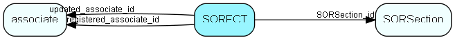

# SORFCT Table (178)

SuperOffice reporter data

## Fields

| Name | Description | Type | Null |
|------|-------------|------|:----:|
|SORFCT\_id|Primary key|PK| |
|SORSection\_id|Foreign key to Section|FK [SORSection](sorsection.md)| |
|fieldType|-1=NULL, 0=hidden, 1=Column, 2=Row, 3=Data, 6=pagenr, 7=title, 8=associatename|Short| |
|content|if field type in (0,1,2,3) then Field name from db to be selected|String(29)|&#x25CF;|
|groupFooterType|-1=NULL, 0=none, 1=Sum, 2=Avg, 3=Count|Short| |
|caption|row/column headers|String(149)|&#x25CF;|
|captionResId|resource id if translatable resource|UInt| |
|totalsCaption|Caption for totals row/column headers|String(149)|&#x25CF;|
|totalsResId|resource id if translatable resource|UInt| |
|aggregateFunction|-1=NULL, 0=Sum, 1=Count, 2=Avg, 3=Max, 4=Min|Short| |
|displayType|-1=NULL, 0=Normal, 1=column|Short| |
|numberFormat|Formatting for data strings, like #0, #000.00 etc|String(19)|&#x25CF;|
|registered|Registered when|UtcDateTime| |
|registered\_associate\_id|Registered by whom|FK [associate](associate.md)| |
|updated|Last updated when|UtcDateTime| |
|updated\_associate\_id|Last updated by whom|FK [associate](associate.md)| |
|updatedCount|Number of updates made to this record|UShort| |

[!include[details](./includes/sorfct.md)]

## Indexes

| Fields | Types | Description |
|--------|-------|-------------|
|SORFCT\_id |PK |Clustered, Unique |
|SORSection\_id |FK |Index |
|fieldType |Short |Index |

## Relationships

| Table|  Description |
|------|-------------|
|[associate](associate.md)  |Employees, resources and other users - except for External persons |
|[SORSection](sorsection.md)  |SuperOffice reporter data |

## Replication Flags

* Replicate changes DOWN from central to satellites and travellers.
* Replicate changes UP from satellites and travellers back to central.
* Copy to satellite and travel prototypes.

## Security Flags

* No access control via user's Role.

