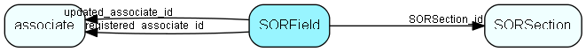

# SORField Table (179)

SuperOffice reporter data

## Fields

| Name | Description | Type | Null |
|------|-------------|------|:----:|
|SORField\_id|Primary key|PK| |
|SORSection\_id|Foreign key to Section|FK [SORSection](sorsection.md)| |
|fieldType|field, label, line, image, pagenr, pages, date, associatename|String(14)| |
|content|Field: db field name; Label: caption; image: file name; otherwise - empty|String(254)|&#x25CF;|
|contentResId|resource id if translatable resource|UInt| |
|setTop|top position in twips|UInt| |
|setLeft|left position in twips|UInt| |
|setHeight|height in twips|UInt|&#x25CF;|
|setWidth|width in twips|UInt| |
|running|-1=NULL, 0=ddSRNone, 1=ddSRGroup, 2=ddSRAll|Short| |
|func|-1=NULL, 0=ddSFSum, 1=ddSFAvg, 2=ddSFCount, 3=dSFMin, 4=ddSFMax|Short| |
|groupType|-1=NULL, 0=ddSMNone, 1=ddSMGrandTotal, 2=ddSMPageTotal, 3=ddSMSubTotal, 4=ddSMPageCount|Short| |
|sgroup|Which group to use for heading: GroupHeader1-3 or empty string|String(14)|&#x25CF;|
|visible|Is field visible, 1=true|UShort| |
|fontName|Name of font|String(149)| |
|fontSize|In points|Short| |
|fontColor|colour index|Int| |
|fontBold|1=bold|UShort| |
|fontItalic|1=iatlic|UShort| |
|fontStrikethrough|1=strikethrough|UShort| |
|fontUnderline|1=underline|UShort| |
|alignment|0=left, 1=right, 2=center|UShort| |
|dataFormat|Field format mask|String(19)| |
|registered|Registered when|UtcDateTime| |
|registered\_associate\_id|Registered by whom|FK [associate](associate.md)| |
|updated|Last updated when|UtcDateTime| |
|updated\_associate\_id|Last updated by whom|FK [associate](associate.md)| |
|updatedCount|Number of updates made to this record|UShort| |

[!include[details](./includes/sorfield.md)]

## Indexes

| Fields | Types | Description |
|--------|-------|-------------|
|SORField\_id |PK |Clustered, Unique |
|SORSection\_id |FK |Index |
|fieldType |String(14) |Index |
|visible |UShort |Index |

## Relationships

| Table|  Description |
|------|-------------|
|[associate](associate.md)  |Employees, resources and other users - except for External persons |
|[SORSection](sorsection.md)  |SuperOffice reporter data |

## Replication Flags

* Replicate changes DOWN from central to satellites and travellers.
* Replicate changes UP from satellites and travellers back to central.
* Copy to satellite and travel prototypes.

## Security Flags

* No access control via user's Role.

