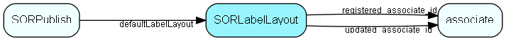

# SORLabelLayout Table (180)

SuperOffice reporter data

## Fields

| Name | Description | Type | Null |
|------|-------------|------|:----:|
|SORLabelLayout\_id|Primary key|PK| |
|name|Name of the label layout|String(239)| |
|paperWidth|Paper width in twips|UInt| |
|paperHeight|Paper height in twips|UInt| |
|topMargin|Top margin in twips|UInt| |
|bottomMargin|Bottom margin in twips|UInt| |
|leftMargin|Left margin in twips|UInt| |
|rightMargin|Right margin in twips|UInt| |
|countColumns|Number og columns|UShort| |
|countRows|Number of rows|UShort| |
|orientation|Paper orientation: 1=portrait, 2=landscape|UShort| |
|printWidth|Calculated: (paperWidth - leftMargin - rightMargin) / countColumns|UInt| |
|labelHeight|Calculated: (paperHeight - topMargin - bottomMargin) / countRows|UInt| |
|registered|Registered when|UtcDateTime| |
|registered\_associate\_id|Registered by whom|FK [associate](associate.md)| |
|updated|Last updated when|UtcDateTime| |
|updated\_associate\_id|Last updated by whom|FK [associate](associate.md)| |
|updatedCount|Number of updates made to this record|UShort| |
|description|Description|String(2047)| |

[!include[details](./includes/sorlabellayout.md)]

## Indexes

| Fields | Types | Description |
|--------|-------|-------------|
|SORLabelLayout\_id |PK |Clustered, Unique |
|name |String(239) |Index |

## Relationships

| Table|  Description |
|------|-------------|
|[associate](associate.md)  |Employees, resources and other users - except for External persons |
|[SORPublish](sorpublish.md)  |SuperOffice reporter data |

## Replication Flags

* Replicate changes DOWN from central to satellites and travellers.
* Replicate changes UP from satellites and travellers back to central.
* Copy to satellite and travel prototypes.

## Security Flags

* No access control via user's Role.

