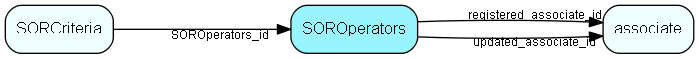

# SOROperators Table (176)

SuperOffice reporter data

## Fields

| Name | Description | Type | Null |
|------|-------------|------|:----:|
|SOROperators\_id|Primary key|PK| |
|operatorType|date, string, number, boolean, list, tree, calendarw, calendarm, selection|String(19)| |
|description|Textual description of operator|String(149)| |
|descriptionResId|Resource ID if description is translatable|UInt| |
|operator1|First operator|String(19)| |
|operator2|Second operator if needed|String(19)|&#x25CF;|
|registered|Registered when|UtcDateTime| |
|registered\_associate\_id|Registered by whom|FK [associate](associate.md)| |
|updated|Last updated when|UtcDateTime| |
|updated\_associate\_id|Last updated by whom|FK [associate](associate.md)| |
|updatedCount|Number of updates made to this record|UShort| |

[!include[details](./includes/soroperators.md)]

## Indexes

| Fields | Types | Description |
|--------|-------|-------------|
|SOROperators\_id |PK |Clustered, Unique |
|operatorType |String(19) |Index |

## Relationships

| Table|  Description |
|------|-------------|
|[associate](associate.md)  |Employees, resources and other users - except for External persons |
|[SORCriteria](sorcriteria.md)  |SuperOffice reporter data |

## Replication Flags

* Replicate changes DOWN from central to satellites and travellers.
* Replicate changes UP from satellites and travellers back to central.
* Copy to satellite and travel prototypes.

## Security Flags

* No access control via user's Role.

