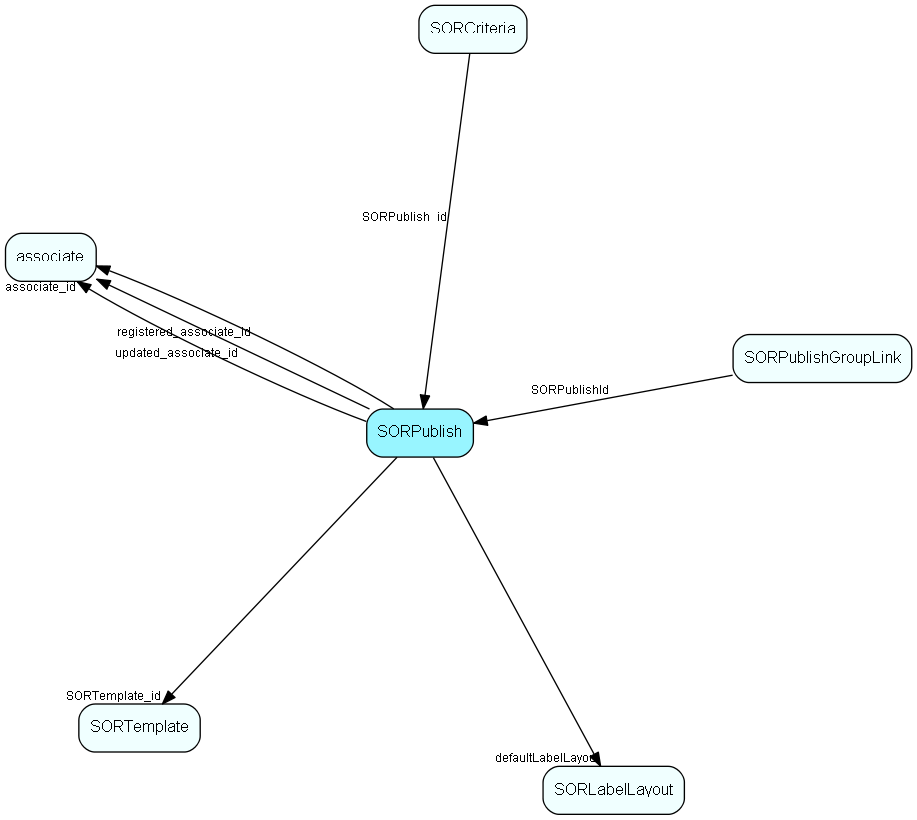

# SORPublish Table (174)

SuperOffice reporter data

## Fields

| Name | Description | Type | Null |
|------|-------------|------|:----:|
|SORPublish\_id|Primary key|PK| |
|SORTemplate\_id|Owning template|FK [SORTemplate](sortemplate.md)| |
|name|Template name|String(239)| |
|nameResId|Resource ID for translatable tempalte names; otherwise 0|UInt| |
|associate\_id|Owner id; 0=SO standard template; 0xFFFFFFFF=owner is Template User (?)|FK [associate](associate.md)| |
|cCount|Label template: column count; Calendar Week: work start hour; otherwise unused (0)|UShort| |
|descriptionResId|ResId of description if translatable text|UInt| |
|defaultLabelLayout|Default template ID|FK [SORLabelLayout](sorlabellayout.md)| |
|forceDefault|Don&apos;t ask the user if there is a default, just use it|UShort| |
|registered|Registered when|UtcDateTime| |
|registered\_associate\_id|Registered by whom|FK [associate](associate.md)| |
|updated|Last updated when|UtcDateTime| |
|updated\_associate\_id|Last updated by whom|FK [associate](associate.md)| |
|updatedCount|Number of updates made to this record|UShort| |
|description|Description text (long)|String(2047)|&#x25CF;|
|isBuiltIn|Is this row a Standard Report? (reset to 0 if report is edited)|UShort|&#x25CF;|
|isEdited|Has this (standard) report been edited? This is nice to know during the next upgrade, to avoid trampling on customizations|Bool|&#x25CF;|

[!include[details](./includes/sorpublish.md)]

## Indexes

| Fields | Types | Description |
|--------|-------|-------------|
|SORPublish\_id |PK |Clustered, Unique |
|SORTemplate\_id |FK |Index |
|name |String(239) |Index |
|associate\_id |FK |Index |
|defaultLabelLayout |FK |Index |
|forceDefault |UShort |Index |

## Relationships

| Table|  Description |
|------|-------------|
|[associate](associate.md)  |Employees, resources and other users - except for External persons |
|[SORCriteria](sorcriteria.md)  |SuperOffice reporter data |
|[SORLabelLayout](sorlabellayout.md)  |SuperOffice reporter data |
|[SORPublishGroupLink](sorpublishgrouplink.md)  |Link table used for filtering reports by user group |
|[SORTemplate](sortemplate.md)  |SuperOffice reporter data |

## Replication Flags

* Replicate changes DOWN from central to satellites and travellers.
* Replicate changes UP from satellites and travellers back to central.
* Copy to satellite and travel prototypes.

## Security Flags

* Sentry controls access to items in this table using user's Role and data rights matrix.

